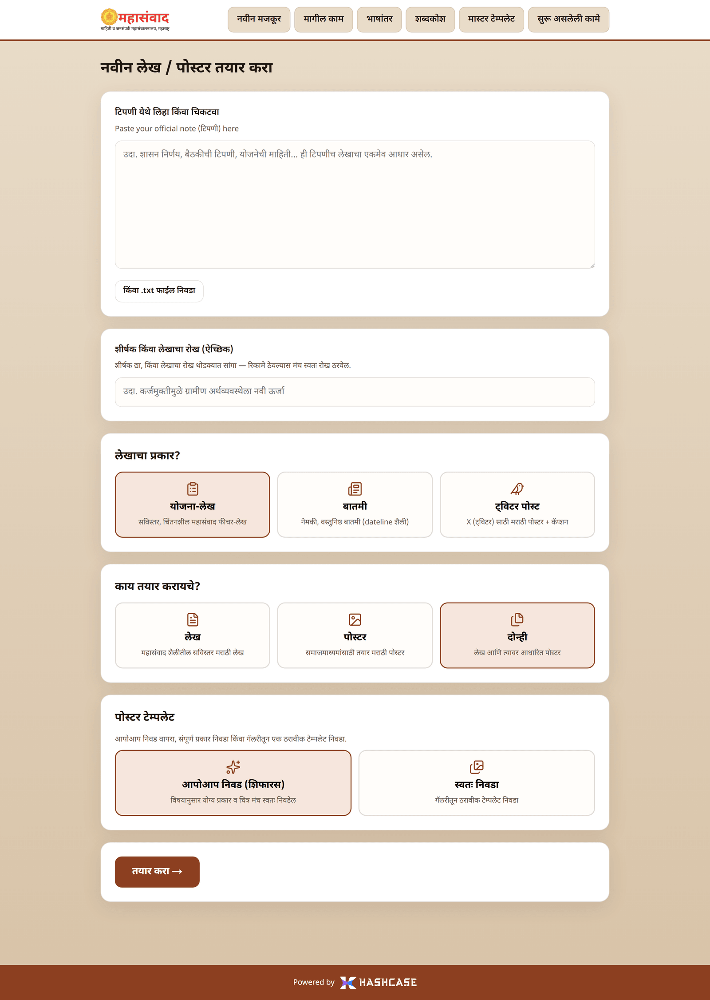

# Introduction — महासंवाद मजकूर मंच

Welcome to the user guide for **महासंवाद मजकूर मंच** (Mahasamvad Content Platform), built for the communication teams of the **माहिती व जनसंपर्क महासंचालनालय, महाराष्ट्र शासन** (Directorate General of Information and Public Relations, Government of Maharashtra).

The platform turns an official note — a Government Resolution (शासन निर्णय), a meeting note, or scheme information — into publication-ready Marathi content:

* **लेख** (Article) — a full Marathi article written in the Mahasamvad house style, as a reflective scheme feature (**"योजना-लेख"**) or a factual news report (**"बातमी"**).
* **पोस्टर** (Poster) — a landscape Marathi poster to accompany the article, ready for social media.
* **ट्विटर पोस्ट** (Twitter post) — a square Marathi poster plus a ready-to-paste caption for X (Twitter).
* **भाषांतर** (Translation) — accurate Marathi → English translation, with a name glossary that keeps official names, designations and scheme names correct.

## What makes the platform trustworthy

Two rules are built into every generation:

1. **Your note is the only source of facts.** The platform never invents names, dates, amounts, designations, scheme names or locations. Every article ends with a fact-check appendix (**"तथ्य-तपासणी"**) showing where each piece of information came from.
2. **Old Mahasamvad articles are style references only.** The system has read thousands of published Mahasamvad articles, but it uses them only to learn tone and structure — never as a source of facts for your new article.

An editor does not restate every line of a note, and neither does the platform: citizen-facing information (benefits, eligibility, deadlines, what a citizen must do) is always kept in the foreground, while administrative machinery (full committee rosters, accounting heads) may be compressed or omitted — deliberately, the way a real editor works.

## Who this guide is for

Everyday users of the platform: communication staff who write and publish. No technical knowledge is needed. Every feature visible on the website is covered, journey by journey — from pasting a note to downloading a finished poster.

## How this guide is written

* The interface is entirely in Marathi. Every button and label is quoted **exactly as it appears on screen**, in bold, with an English explanation on first use — for example: click **"तयार करा →"** (Create).
* Each journey is a numbered list of steps, with screenshots from the real application.
* Error messages you may see are collected in a small table at the end of the relevant chapter, and all of them again in [FAQ & Troubleshooting](faq-troubleshooting.md).

## The journeys

| Chapter                                                      | What you will learn                                                          |
| ------------------------------------------------------------ | ---------------------------------------------------------------------------- |
| [Getting Around](getting-around.md)                          | The menu bar, the ongoing-tasks panel, using the platform on a phone         |
| [Journey 1: Create](create-content.md)                       | Enter a note and start an article, poster, or both                           |
| [Journey 2: Progress & Results](progress-and-results.md)     | Follow the live progress and read the finished article, summary and poster   |
| [Journey 3: Feedback](improve-with-feedback.md)              | Improve the article or poster with one-tap or written feedback               |
| [Journey 4: Twitter Posts](twitter-posts.md)                 | Create a Twitter poster + caption, and track it as a background task         |
| [Journey 5: Next Steps & History](next-steps-and-history.md) | Reuse the same note across formats, follow a note's thread, browse past work |
| [Translation](translation.md)                                | Translate any Marathi text to English                                        |
| [Glossary](glossary.md)                                      | Review and verify the Marathi → English name dictionary                      |
| [Master Templates](master-templates.md)                      | _(Admin)_ Manage the poster template library                                 |
| [FAQ & Troubleshooting](faq-troubleshooting.md)              | Every error message, and answers to common questions                         |
