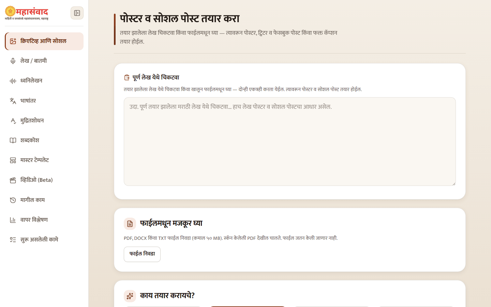

# Introduction — महासंवाद मजकूर मंच

**महासंवाद मजकूर मंच** (Mahasamvad Content Platform) helps Government of Maharashtra communication teams turn official source material into publication-ready content. The interface is Marathi-first and does not require a sign-in.

## What you can do

- Create a Marathi **क्रिएटिव्ह**, **लेख पोस्टर**, or **यूट्यूब थंबनेल** from a finished article.
- Turn meeting notes, audio, YouTube videos, PDFs, DOCX files, and TXT files into a **योजना-लेख** or **बातमी**.
- Transcribe audio and YouTube links without rewriting the speaker's words.
- Translate pasted text or documents into English or Hindi after reviewing names.
- Proofread Marathi or English for spelling, grammar, punctuation, names, and Mahasamvad style.
- Create a branded landscape or vertical Marathi explainer video.
- Download, revise, publish, restore earlier versions, and reuse completed work.
- Maintain the shared name glossary and poster master-template library.
- Review department-wide usage and attributable service costs.

## The two accuracy rules

1. **Official material is the factual source.** Check names, dates, amounts, designations, scheme names, and instructions before you start. The article result includes **तथ्य-तपासणी (माहिती कुठून आली?)** and **मूळ टिपणी** sections for review.
2. **References guide style or structure, not facts.** A Mahasamvad article can guide writing style, and a poster master can guide visual structure. Information from either reference must not be copied into the new work unless it is also present in your source.


AI assists the officer; it does not replace official approval. Read the final text, inspect every poster or video frame, and verify sensitive facts against the original document before publication.


## How this guide is written

The website labels are quoted exactly in Marathi. For example, **"तयार करा →"** means Create. Each chapter follows one real user journey and explains what is saved, what may incur processing cost, and what to check before continuing.

Start with [Getting Around the Platform](getting-around.md), or go directly to the task you need in the table of contents.
