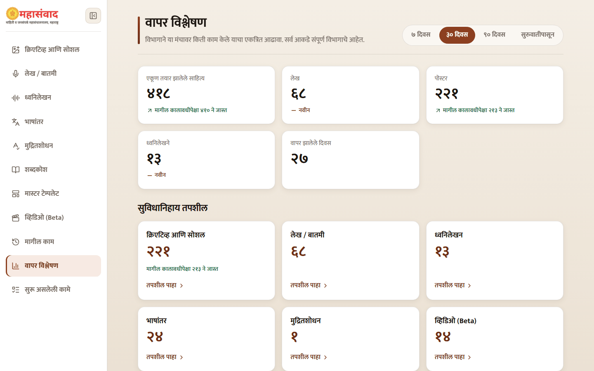
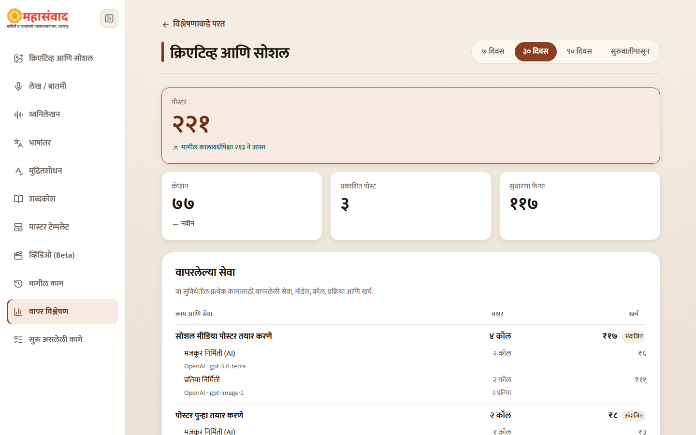

# Usage Analytics

Open **"वापर विश्लेषण"** to review department-wide platform use. It does not show individual-user activity.

## Choose a period

Use **"७ दिवस"**, **"३० दिवस"**, **"९० दिवस"**, or **"सुरुवातीपासून"**. The overview includes total outputs, feature-level counts, a daily trend, and a share of work by feature.

Select a feature card to open its detail page.

## Read the service table

**"वापरलेल्या सेवा"** groups every paid call under the user-facing task that caused it. A task may contain several service rows, each showing:

- service and provider;
- configured model;
- actual call count;
- the natural unit processed, such as audio minutes, pages, images, or clips;
- attributable estimated cost.

Examples include transcription, scanned-document OCR, designation extraction, article drafting and verification, translation, proofreading, poster/caption work, thumbnails, and each video phase.

Some values carry an **"अंदाजित"** badge because provider pricing or measurement is estimated. Analytics is an operational estimate, not a supplier invoice.

## Historical limitations

Exact task attribution begins from the task-tracking deployment. Older AI usage that cannot be reconstructed truthfully is labelled **"पूर्वीची एकत्रित AI नोंद"**. DLO analytics represents the current article-only UI and does not claim unrelated poster-generation cost.


Cost logging is fire-and-forget: an analytics-write problem does not fail the officer's content task. Consequently, treat totals as monitoring data, not as a guarantee that every provider charge is present.

