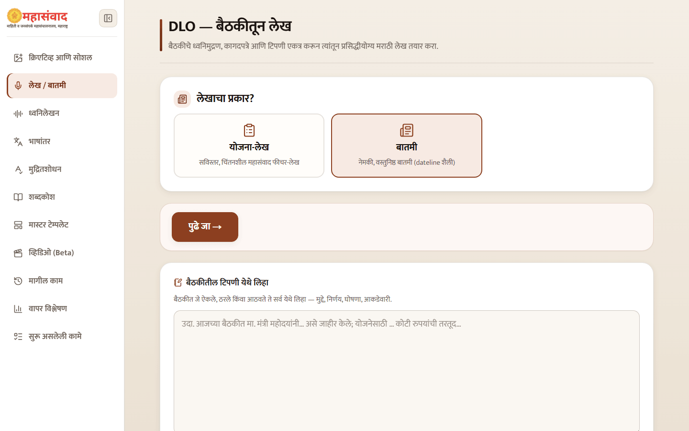
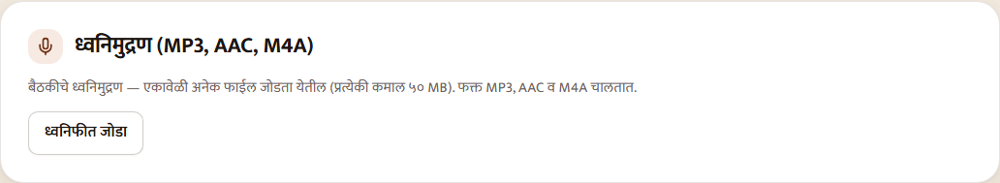
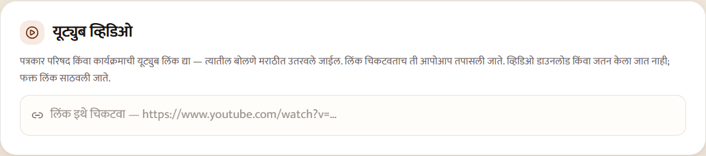
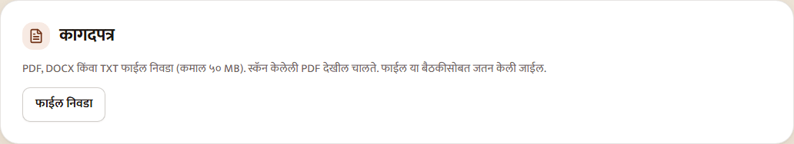
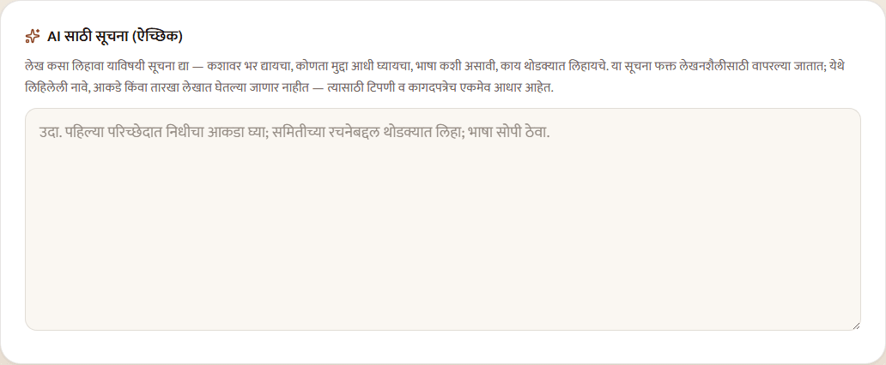
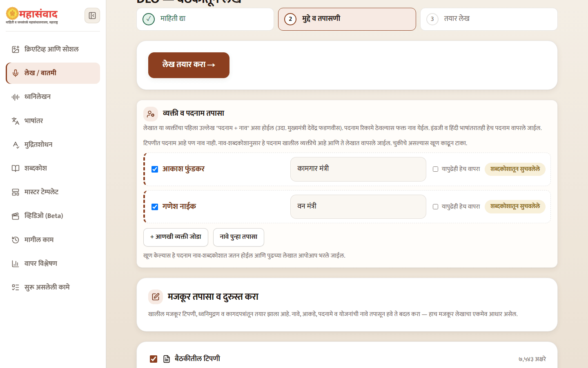
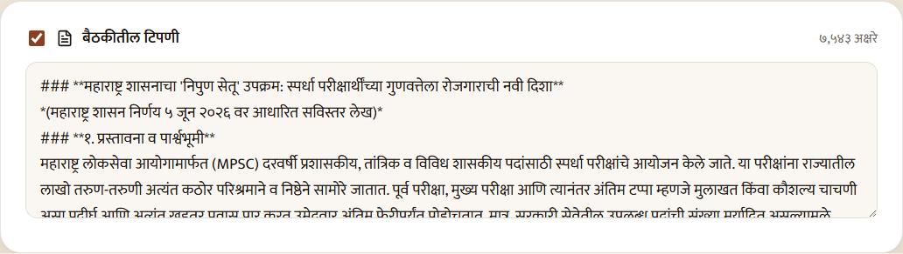

# Create an Article or News Report

Use **"लेख / बातमी"** for the full DLO workflow: provide source material, review extracted text and people, then generate one Marathi article.

## 1. Choose the writing form

- **"योजना-लेख"** — a detailed, reflective Mahasamvad feature.
- **"बातमी"** — a concise factual report. News articles receive the current Mumbai dateline automatically.

## 2. Add one or more sources

You may combine these in the same intake:

- **"बैठकीतील टिपणी"** — paste notes directly.
- **"ध्वनिमुद्रण (MP3, AAC, M4A)"** — select **"ध्वनिफीत जोडा"** for recorded speech.
- **"यूट्युब व्हिडिओ"** — paste one YouTube link per line.
- **"कागदपत्र"** — add PDF, DOCX, or TXT files; use **"आणखी कागदपत्र जोडा"** for additional files.

You may also provide an optional heading, an **"AI साठी सूचना (ऐच्छिक)"** instruction, and the URL of a published Mahasamvad article whose writing style should be followed.

Select **"पुढे जा →"**. Audio transcription, YouTube transcription, document reading, and name/designation preparation then run as required.

## 3. Review before generation

The step rail shows **"माहिती द्या" → "मुद्दे व तपासणी" → "तयार लेख"**. Nothing is generated until you approve the middle step.

First review **"व्यक्ती व पदनाम तपासा"**. Untick an unrelated suggested person, correct a designation, choose whether to remember it, or use **"+ आणखी व्यक्ती जोडा"**. A suggestion from the glossary is still your responsibility to confirm.

Then review each source. Correct OCR or transcription errors directly and untick any source or page that should not be used.

For every PDF, select pages before OCR. Only selected pages are read, which preserves table structure without charging for excluded covers, annexures, or blank pages. OCR can incur page-based processing cost. DOCX and TXT files do not need page selection.

Finally confirm the article type, heading, AI instruction, and style reference, then select **"लेख तयार करा →"**.


This review screen is the last approval point before article-generation services run. Verify names, designations, dates, amounts, and selected pages against the originals.


## Reuse the same intake

A completed DLO article offers **"याच स्रोतातून पुन्हा लेख तयार करा"**. It returns to the saved review state, where you can change the selection or instructions without re-uploading the sources.
