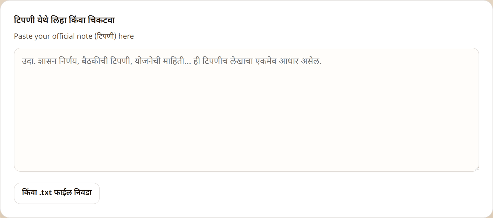
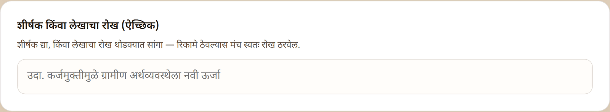
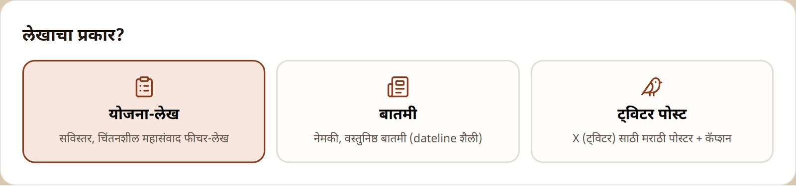
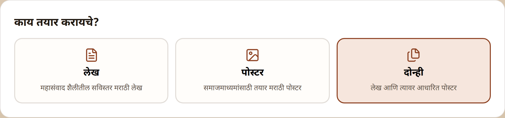
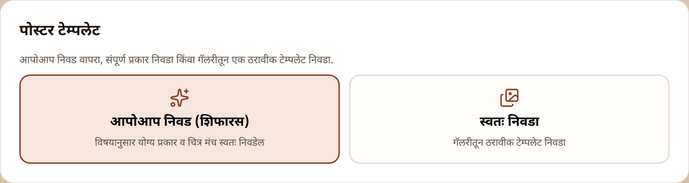
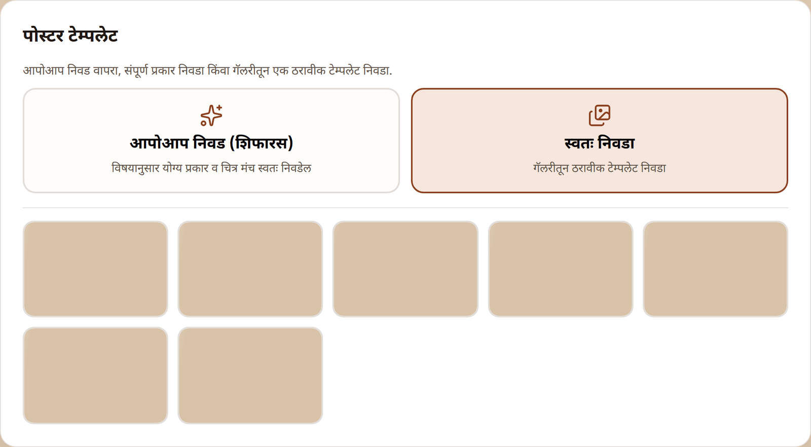
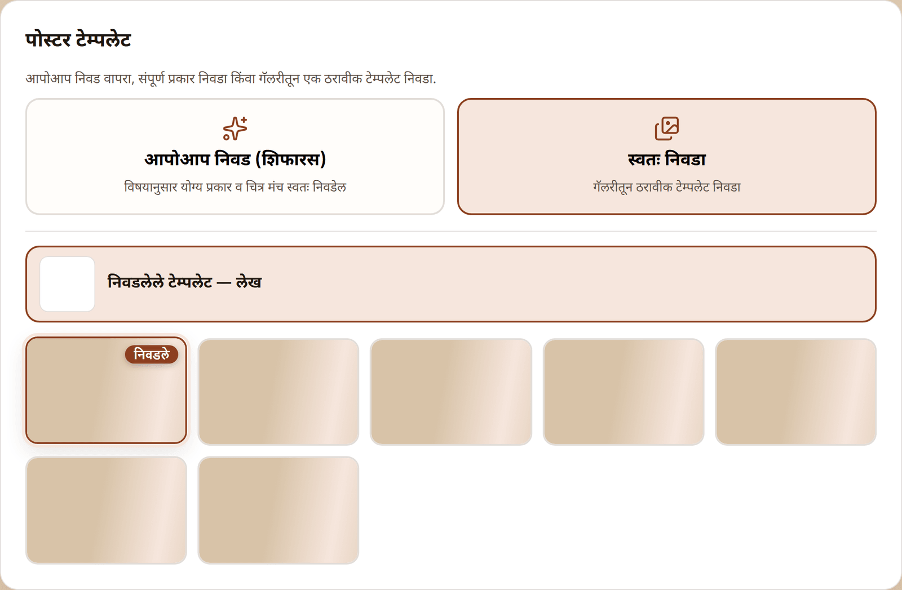
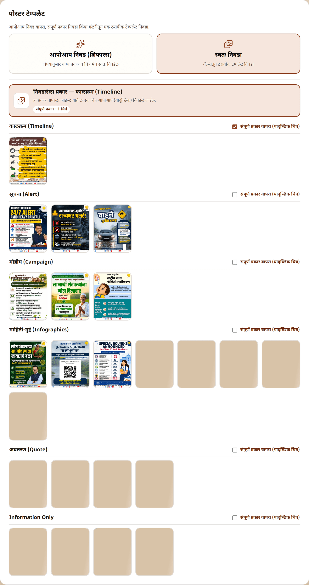
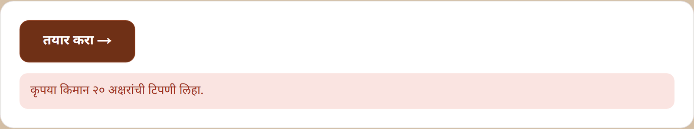
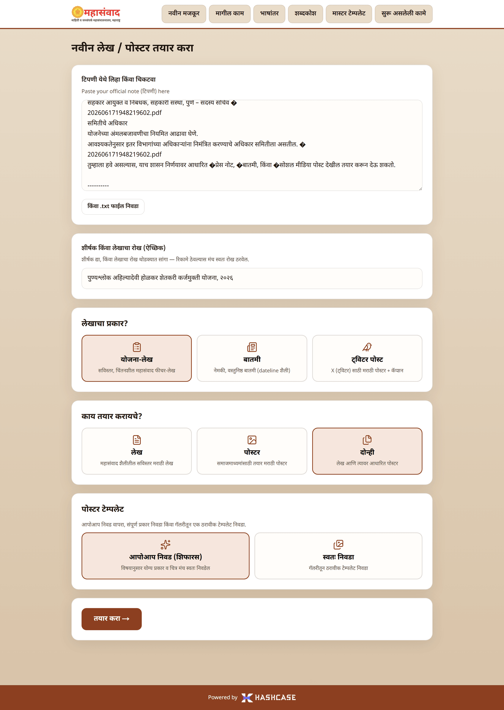

# Journey 1: Create an Article & Poster ("नवीन मजकूर")

Everything begins on the home page — **"नवीन लेख / पोस्टर तयार करा"** (Create a new article / poster). You fill four short cards from top to bottom and press one button.

## Step 1 — Enter your note ("टिपणी")

The note is the **only** source of facts for everything the platform creates, so give it the complete official text: a शासन निर्णय (GR), a meeting note, or scheme information.

* Type or paste the note into the large box — **"टिपणी येथे लिहा किंवा चिकटवा"** (Write or paste the note here).
* Or click **"किंवा .txt फाईल निवडा"** (Or choose a .txt file) to load the note from a plain-text file. Only `.txt` files are accepted.
* The note must be at least 20 characters long.

## Step 2 — Optional heading or angle ("शीर्षक")

You may give a headline, or briefly state the angle you want the article to take (**"शीर्षक किंवा लेखाचा रोख (ऐच्छिक)"**). Leave it empty and the platform chooses the angle itself.

## Step 3 — Choose the content type ("लेखाचा प्रकार?")

| Card | What it produces |
| --- | --- |
| **"योजना-लेख"** (Scheme article) | A detailed, reflective Mahasamvad-style feature article |
| **"बातमी"** (News) | A precise, factual news report in dateline style |
| **"ट्विटर पोस्ट"** (Twitter post) | A square Marathi poster + caption for X (Twitter) — this path is covered in [Journey 4](twitter-posts.md) |


If a card appears greyed out, a job of that kind is already running — one article job and one Twitter job can run at a time. Wait for it to finish (watch **"सुरू असलेली कामे"**).


## Step 4 — Choose what to produce ("काय तयार करायचे?")

For **"योजना-लेख"** and **"बातमी"** a fourth card asks what to generate:

* **"लेख"** (Article) — the article only.
* **"पोस्टर"** (Poster) — the landscape poster only.
* **"दोन्ही"** (Both) — the article **and** a poster based on it. This is the most common choice.

*(For a Twitter post this card is replaced by the design-style card — see [Journey 4](twitter-posts.md).)*

## Step 5 — Poster template ("पोस्टर टेम्पलेट")

Whenever a poster will be produced, a template picker appears. Posters are painted over a **master template** from the library (see [Master Templates](master-templates.md)).

* **"आपोआप निवड (शिफारस)"** (Automatic choice — recommended): the platform picks a suitable template itself. If several template images are enabled, one is chosen at random for each run, so posters stay varied.
* **"स्वतः निवडा"** (Choose yourself): opens the gallery of enabled template images.

In the gallery you can pin your choice at two levels:

1. **Pin one exact image** — click a thumbnail. It is marked **"निवडले"** (Selected) and a summary line **"निवडलेले टेम्पलेट"** (Selected template) appears at the top. That exact image will be used.

   

2. **Pin a whole type** *(Twitter templates only)* — tick **"संपूर्ण प्रकार वापरा (यादृच्छिक चित्र)"** (Use the whole type — random image) on a group heading. The platform will use that type but still pick one of its enabled images at random.

   

Clicking a selected thumbnail (or unticking the box) removes the pin. Picking a thumbnail and ticking a type box are mutually exclusive — the newer choice wins.

## Step 6 — Create ("तयार करा →")

Press **"तयार करा →"** (Create). For an article or news run the browser moves straight to the progress page ([Journey 2](progress-and-results.md)). While it sends, the button reads **"पाठवत आहोत…"** (Sending…).

If something is wrong, the form tells you below the button:

| Message | Meaning | What to do |
| --- | --- | --- |
| **"कृपया किमान २० अक्षरांची टिपणी लिहा."** | The note is shorter than 20 characters | Paste the full note |
| **"कृपया फक्त .txt फाईल निवडा."** | The uploaded file is not a `.txt` | Save the note as plain text and retry |
| **"एक काम आधीच सुरू आहे. ते पूर्ण होईपर्यंत थांबा."** | A job in this lane is already running | Wait for it to finish, then create |

## A filled form, ready to go

