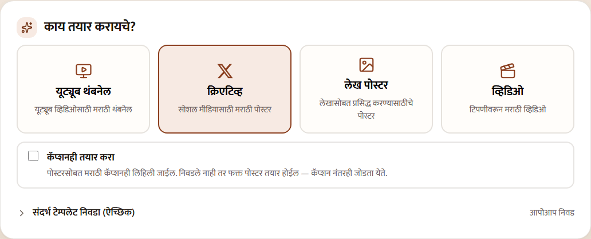
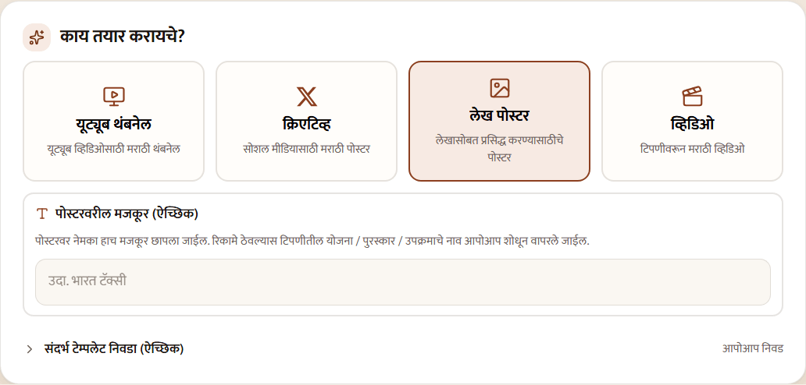
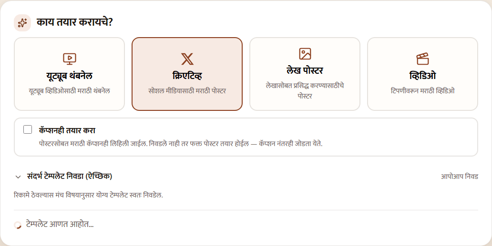

# Create a Creative or Social Post

Use **"क्रिएटिव्ह आणि सोशल"** when you already have a finished Marathi article and need its visual form.

## 1. Add the article

Paste the complete article under **"पूर्ण लेख येथे चिकटवा"**, or select **"फाईल निवडा"** to use a PDF, DOCX, or TXT file. Every PDF asks you to select pages before OCR; DOCX and TXT go directly to text review. Uploaded files and extracted text are reviewed before use.

## 2. Choose what to create

Under **"काय तयार करायचे?"**, choose one format:

- **"यूट्यूब थंबनेल"** — a Marathi YouTube thumbnail.
- **"क्रिएटिव्ह"** — a DGIPR-branded social-media poster. Tick **"कॅप्शनही तयार करा"** if you also want a caption.
- **"लेख पोस्टर"** — a landscape poster to publish with an article.
- **"व्हिडिओ"** — opens the separate video workflow.

When **"लेख पोस्टर"** is selected, you may enter an exact poster heading. Leave it blank to let the platform choose the main named subject from the article.

## 3. Choose a reference only when needed

Open **"संदर्भ टेम्पलेट निवडा (ऐच्छिक)"** to use a master template. **"आपोआप निवड"** is the recommended default: it selects a layout with enough room for the article's content.

The reference controls layout and structure. Its words, numbers, logo, colours, and factual claims are not source material for the new creative.

## 4. Start

Select **"तयार करा →"**. The work appears under **"सुरू असलेली कामे"**, and the result page opens automatically.

Before starting, confirm:

- the pasted text is the final approved Marathi article;
- the chosen format matches the intended channel;
- an article-poster heading is exact, if you supplied one;
- a manually selected template has enough content capacity.


The creative follows the fixed DGIPR template treatment and receives official logo/footer chrome after image creation. Do not ask the image model to paint or replace the government identity.

