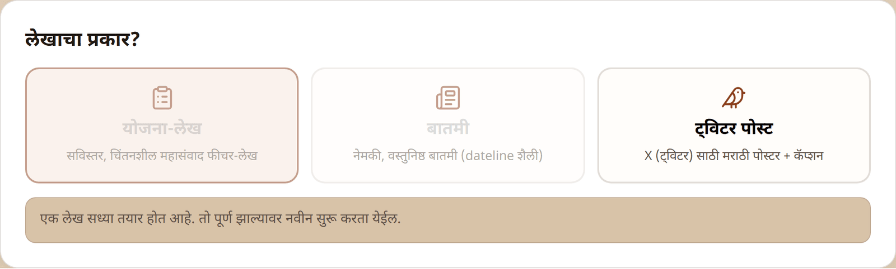

# FAQ & Troubleshooting

## Common questions

### Why is a card on the create form greyed out?

One job of each kind runs at a time — one article-type job (**"योजना-लेख"** / **"बातमी"**) and one Twitter job. While an article is being generated, the article cards are disabled and the form explains why:

The two lanes are independent: a running article does not block a Twitter post, and vice versa. Wait for the running job (watch **"सुरू असलेली कामे"**), then create the next one.

### My "सुरू असलेली कामे" list is empty after a refresh — is my work lost?

No. That panel only tracks the current browser session. Everything ever created is permanently listed under **"मागील काम"** (Past work) — find the run there and open it.

### How long does a run take?

Typically **several minutes** — a full article with poster is the longest, a Twitter post somewhat shorter. You never need to keep the page open: the run continues on the server, and the page (or the history) always shows the current state.

### A run failed ("अयशस्वी") — what now?

Open the run: the page shows **"काम अपूर्ण राहिले"** (The work was left incomplete) with the reason, and a **"पुन्हा प्रयत्न करा"** (Try again) button that starts a fresh run from the same note and settings. The failure is usually temporary. If an article had already been produced before a poster step failed, the article is still shown below the notice — nothing already generated is lost.

### The poster's wording or look isn't right — should I regenerate everything?

No. Use the poster's own feedback box (**"चित्रात बदल हवा आहे?"**) and describe the change — wording, size, colours, layout. Each instruction is applied to the current poster, every version is kept, and you can always go back (see [Journey 3](improve-with-feedback.md)).

### A name is translated wrong in English.

Fix it once in the [**शब्दकोश**](glossary.md): correct the English, mark the entry **"तपासले"** (verified). Every future translation then uses your spelling automatically.

### Can I trust the numbers and names in the article?

The article is written **only** from your note — the platform never invents names, dates, amounts, designations, scheme names or locations. To double-check any claim, open **"तथ्य-तपासणी (माहिती कुठून आली?)"** under the article: it maps each fact to its source. The original note itself is always attached under **"मूळ टिपणी"**.

### Why doesn't the article repeat every line of my note?

By design. Like a human editor, the platform keeps citizen-relevant facts (benefits, eligibility, deadlines, actions) in the foreground and may compress purely administrative detail (full committee rosters, accounting heads). The completeness check (**"लेखाची पूर्णता तपासत आहोत…"**) ensures nothing important is dropped.

### Is text I translate on the भाषांतर page stored?

No — ad-hoc translations are not saved (**"हा मजकूर जतन केला जाणार नाही."**). Download or copy the result before leaving the page.

## Every message the platform may show

### Create form

| Message | Meaning | What to do |
| --- | --- | --- |
| **"कृपया किमान २० अक्षरांची टिपणी लिहा."** | Note under 20 characters | Paste the full note |
| **"कृपया फक्त .txt फाईल निवडा."** | Uploaded file isn't `.txt` | Save the note as plain text |
| **"एक काम आधीच सुरू आहे. ते पूर्ण होईपर्यंत थांबा."** | This lane already has a running job | Wait for it to finish |
| **"एक लेख सध्या तयार होत आहे…"** / **"एक ट्विटर पोस्ट सध्या तयार होत आहे…"** | Why the cards are disabled | Wait; the other lane stays available |
| **"एकही टेम्पलेट चित्र वापरात नाही…"** (in the template picker) | No template image is enabled for this category | Ask your admin to enable images on **"मास्टर टेम्पलेट"** |

### Feedback boxes

| Message | Meaning | What to do |
| --- | --- | --- |
| **"कृपया थोडक्यात अभिप्राय लिहा."** | Feedback box is (nearly) empty | Write at least a short instruction |

### Translation

| Message | Meaning | What to do |
| --- | --- | --- |
| **"मजकूर १०,००० अक्षरांपेक्षा जास्त आहे."** | Text exceeds the 10,000-character limit | Split the text and translate in parts |

### Templates (admin)

| Message | Meaning | What to do |
| --- | --- | --- |
| **"कृपया PNG, JPEG किंवा WebP चित्र निवडा."** | Unsupported image format | Convert the master to PNG/JPEG/WebP |
| **"या प्रकारातील एकही चित्र सध्या वापरात नाही."** | Type has no enabled image; runs needing it will fail | Enable at least one image (**"वापरा"**) |

### Anywhere

| Message | Meaning | What to do |
| --- | --- | --- |
| **"काहीतरी चुकले. कृपया पुन्हा प्रयत्न करा."** | A general, usually temporary error | Try again; if it persists, contact your administrator |
| **"क्षमस्व, काहीतरी चुकले. पुन्हा प्रयत्न करून पहा."** | A run failed | Use **"पुन्हा प्रयत्न करा"** on the run's page |
