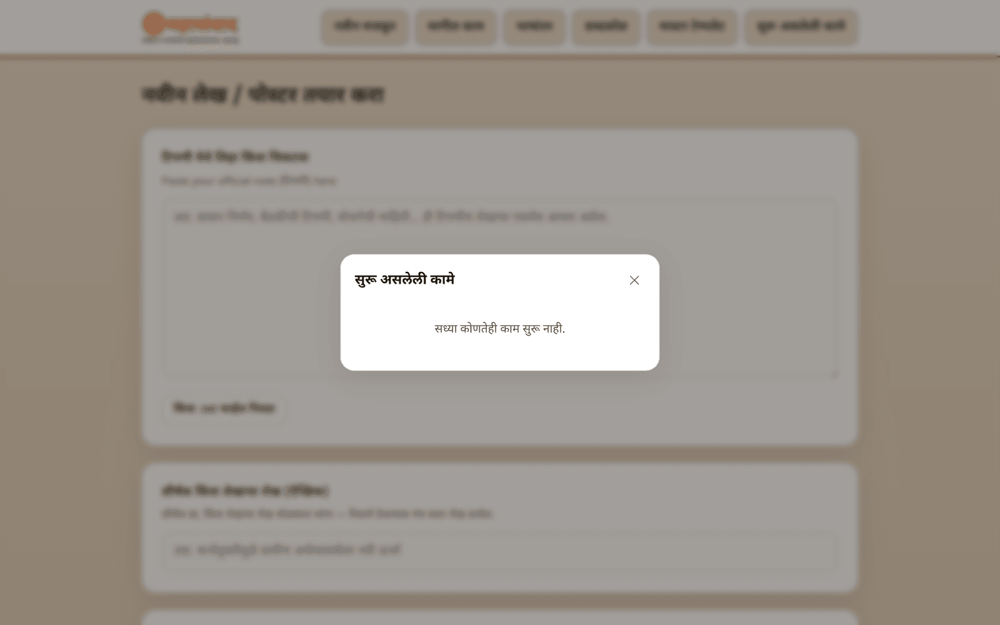
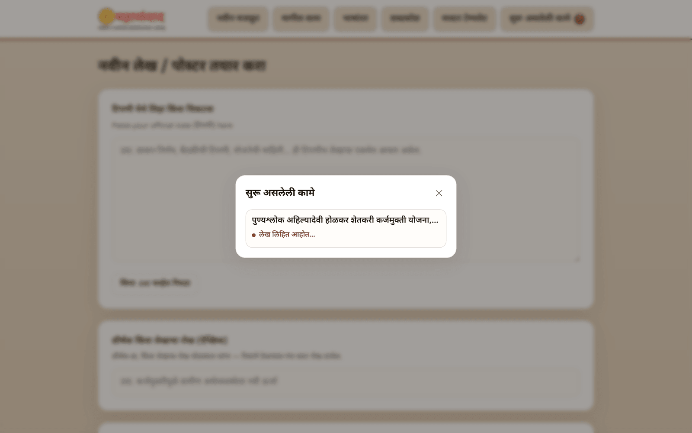
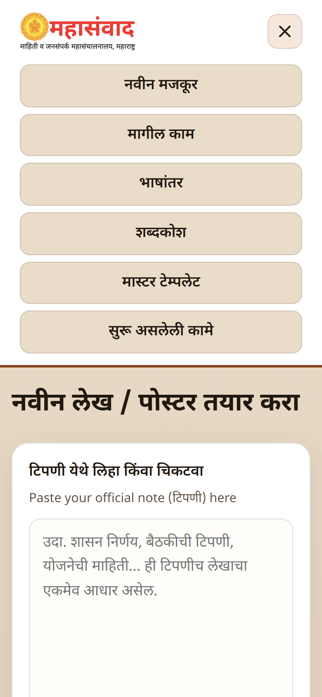

# Getting Around the Platform

Everything starts from the menu bar at the top of every page.

## The menu (top of every page)

| Menu item                                | Where it takes you                                             |
| ---------------------------------------- | -------------------------------------------------------------- |
| **महासंवाद logo**                        | Back to the home page (same as **"नवीन मजकूर"**)               |
| **"नवीन मजकूर"** (New content)           | The create form — start a new article, poster, or Twitter post |
| **"मागील काम"** (Past work)              | History of everything ever created, searchable                 |
| **"भाषांतर"** (Translation)              | Translate any Marathi text to English                          |
| **"शब्दकोश"** (Glossary)                 | The Marathi → English name dictionary used by translations     |
| **"मास्टर टेम्पलेट"** (Master templates) | _(Admin)_ The poster template library                          |
| **"सुरू असलेली कामे"** (Ongoing tasks)   | Opens the tasks panel — see below                              |

## The ongoing-tasks panel ("सुरू असलेली कामे")

The last button in the menu opens a small panel listing every generation **you started in this browser session**. While something is running, the button shows a count badge.

While an article is being generated, the same panel shows the run with its live step:

Inside the panel:

* Each row shows the work's title, a status dot, and the **live step** it is on (for example **"पोस्टरचे चित्र तयार करत आहोत…"** — _preparing the poster image_). The dot pulses while the work is running.
* Twitter posts also show a small poster thumbnail once ready.
* **Click any row** to open that work's full page.
* Close the panel with the **✕** button, by pressing `Escape`, or by clicking outside it.


The tasks panel only remembers the current browser session. If you refresh or close the tab, the list starts empty — your work is **not** lost: everything is always available under **"मागील काम"** (Past work).


One more rule to know: the platform runs **one article-type job and one Twitter job at a time**. While an article is being generated, the article cards on the create form are disabled (Twitter stays available, and vice versa). The form explains this with a message such as **"एक लेख सध्या तयार होत आहे. तो पूर्ण झाल्यावर नवीन सुरू करता येईल."** (_An article is currently being created. A new one can be started once it finishes._)

## On a phone or a narrow window

Below tablet width the menu collapses behind a hamburger button (**"मेनू"**). Tap it to open the full menu; tap **✕** to close.

