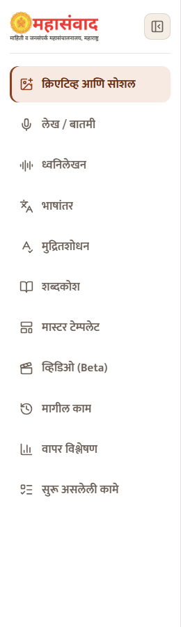
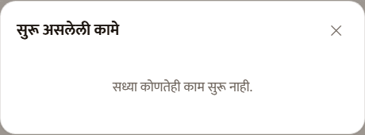
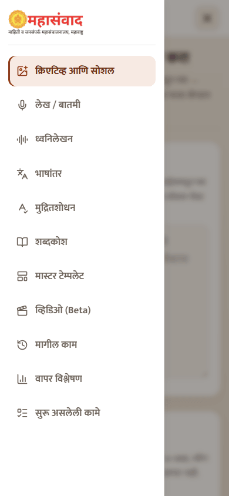

# Getting Around the Platform

The desktop application uses a permanent menu on the left. The highlighted row shows the page you are using.

## Menu pages

| Marathi label           | Use it for                                                                     |
| ----------------------- | ------------------------------------------------------------------------------ |
| **क्रिएटिव्ह आणि सोशल** | Posters, social creatives, article posters, and YouTube thumbnails             |
| **लेख / बातमी**         | A scheme article or news report from notes, recordings, YouTube, and documents |
| **ध्वनिलेखन**           | Exact transcription of audio and YouTube                                       |
| **भाषांतर**             | English or Hindi translation                                                   |
| **मुद्रितशोधन**         | Marathi or English proofreading                                                |
| **शब्दकोश**             | Shared Marathi, English, Hindi, and designation spellings                      |
| **मास्टर टेम्पलेट**     | Admin poster-template library                                                  |
| **व्हिडिओ (Beta)**      | Branded landscape or vertical videos                                           |
| **मागील काम**           | Search and reopen saved generations                                            |
| **वापर विश्लेषण**       | Department-wide outputs, service use, and cost estimates                       |

Use the small collapse button beside the logo when you need more horizontal space. The icons remain available while the menu is collapsed.

## Ongoing work

Long operations continue in the background. Select **"सुरू असलेली कामे"** at the bottom of the menu to see them.

- Select a task to open its progress or result page.
- You can leave a generation page while work continues.
- A failed task shows an error and, when supported, a retry action.
- The panel is not the permanent archive; use **"मागील काम"** for completed saved work.

## On a phone

Select the menu button at the top-left to open the same navigation as a drawer. Select a destination and the drawer closes.


The interface can be opened without signing in. Anyone with the application address can reach the pages, so do not paste material that your department has not authorised for this system.

