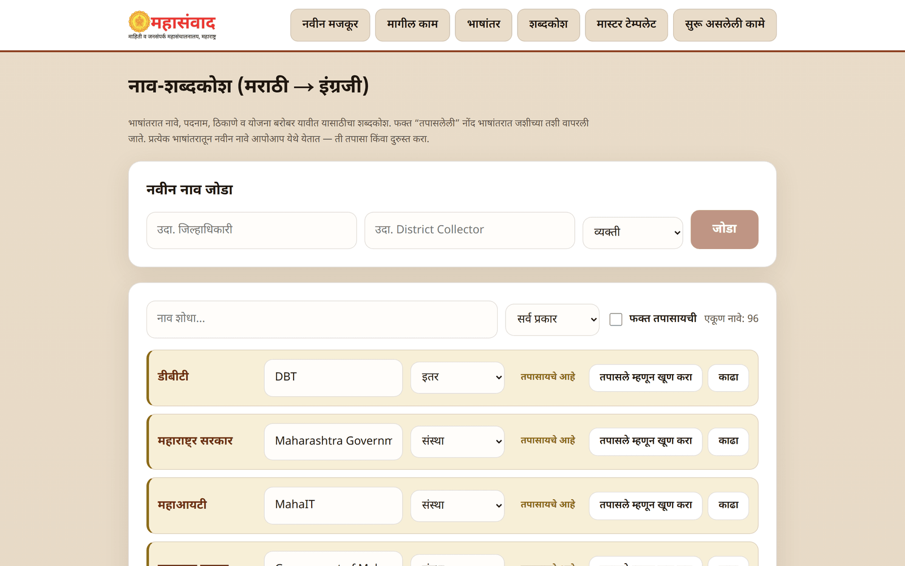
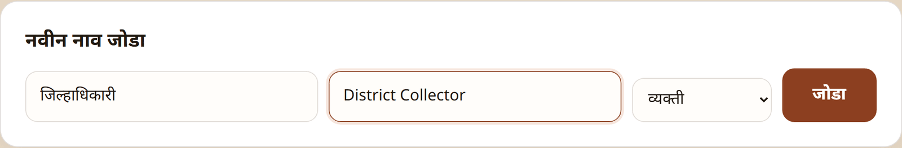
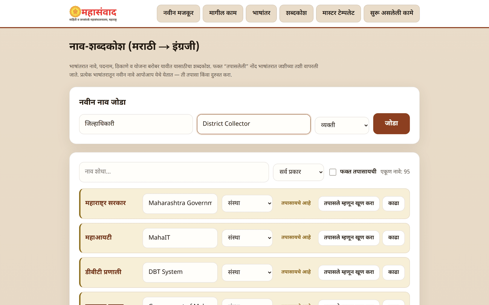

# Glossary ("नाव-शब्दकोश")

The **"शब्दकोश"** page manages the **नाव-शब्दकोश (मराठी → इंग्रजी)** — the name dictionary that keeps English translations accurate. Whenever the platform translates (an article, or text on the [भाषांतर page](translation.md)), every **verified** entry here is used exactly as written — a person's name, a designation, a scheme name, a place — instead of being re-guessed each time.

New candidate names flow in automatically from translations (when term-mining is on); your team's job on this page is to **review, correct, and verify** them.

## Adding a name yourself ("नवीन नाव जोडा")

1. **"मराठी"** — the name as it appears in Marathi (e.g. जिल्हाधिकारी).
2. **"इंग्रजी"** — the exact English rendering you want (e.g. District Collector).
3. **"प्रकार"** (Type) — one of: **व्यक्ती** (person), **पदनाम** (designation), **योजना** (scheme), **ठिकाण** (place), **संस्था** (organisation), **इतर** (other).
4. Click **"जोडा"** (Add). Names you add yourself are trusted immediately — they enter as **"तपासले"** (verified).

## Finding entries

The toolbar above the list:

* **"नाव शोधा…"** (Search names) — filters as you type.
* The type dropdown — show one type only, or **"सर्व प्रकार"** (all types).
* **"फक्त तपासायची"** (Only those to review) — show only unverified entries. This is the daily review view.
* **"एकूण नावे: N"** — the current count.

## Reviewing a row

Each row shows the Marathi name (fixed), an **editable** English field, and the type. Rows are tagged either **"तपासले"** (Verified — used in translations) or **"तपासायचे आहे"** (To be reviewed).

* Corrected the English or the type? A **"जतन करा"** (Save) button appears — click it to store the change.
* **"तपासले म्हणून खूण करा"** (Mark as verified) — approves the entry; from now on every translation uses it verbatim. **"खूण काढा"** (Remove the mark) un-verifies it again.
* **"काढा"** (Delete) — removes the entry after the confirmation **"हे नाव कायमचे काढायचे?"** (Permanently remove this name?).


Only **verified** entries lock into translations. An unverified candidate does no harm — but it also doesn't help until someone reviews it. A few minutes of review after big translations steadily improves every future translation.

