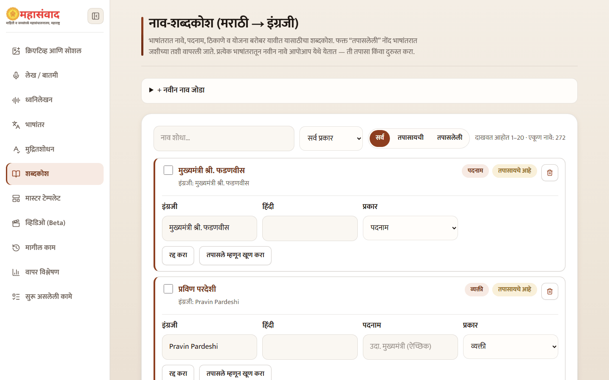
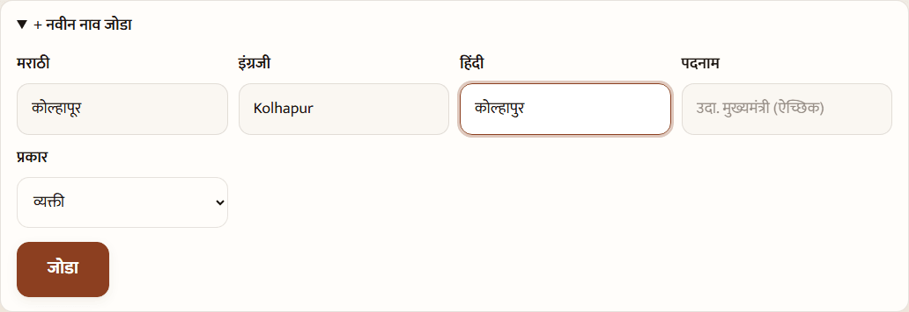

# Glossary

Use **"शब्दकोश"** to maintain the shared spellings used for translation, name checks, and article designations.

## What a row contains

- **मराठी** source spelling;
- **इंग्रजी** spelling;
- **हिंदी** spelling;
- type: person, place, organisation, scheme, designation, or other;
- a designation when the row represents a person;
- verification status.

Only a verified row is treated as an approved dictionary form. An unverified row is a candidate for officer review, not an authority.

## Find and review rows

Use search, type, and status filters. The list is paginated. Select one or more unverified rows for bulk verification only after checking every spelling and type.

For a person, confirm that the designation belongs to that exact full name. A one-word surname must not be used to infer another person's portfolio.

## Add a row

Open **"+ नवीन नाव जोडा"**, enter the spellings and type, then select **"जोडा"**.

For Hindi, enter the correct Hindi orthography even when it differs from Marathi—for example, a final vowel may legitimately change. Leaving the Hindi form empty falls back to the Marathi form where supported.

## Edit, verify, or delete

- **"बदला"** edits a row; choose **"जतन करा"** when finished.
- **"तपासले म्हणून खूण करा"** verifies an approved row.
- **"खूण काढा"** returns it to review status.
- **"काढा"** permanently deletes it after confirmation.


Glossary changes affect future work across the department. Never verify a guessed spelling or designation. Deleting a row is permanent and should be limited to duplicates or clearly incorrect records.

