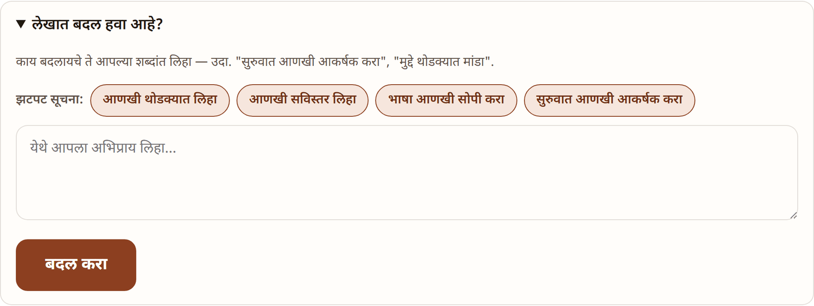
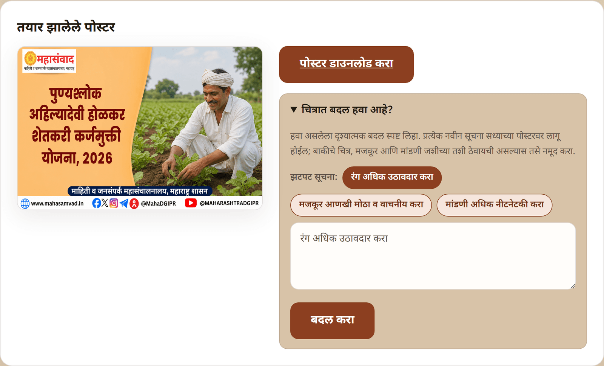
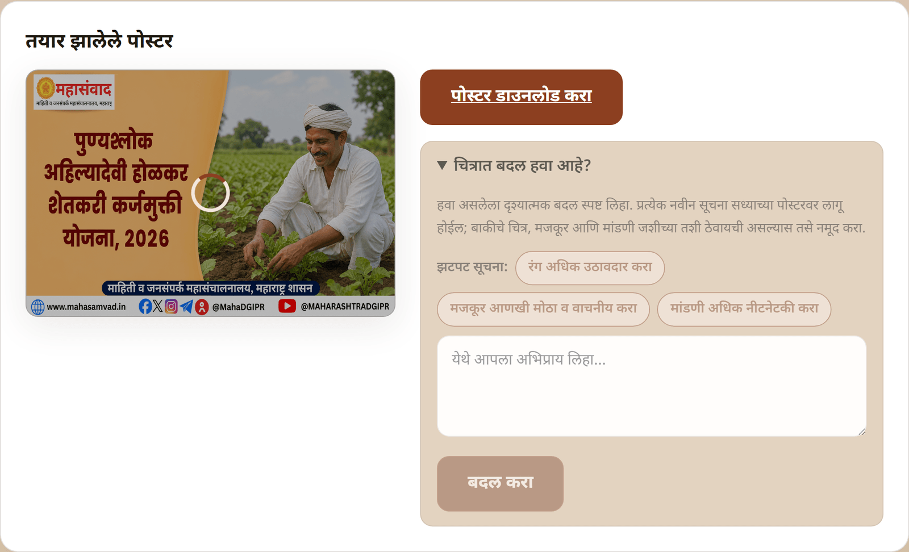
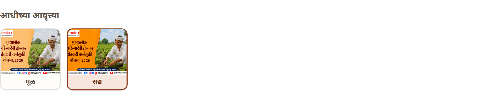

# Journey 3: Improve Results with Feedback

Nothing the platform produces is final — the article and the poster each have their own feedback loop, right on the work's page. Feedback is written in plain Marathi, in your own words.

## Improving the article ("लेखात बदल हवा आहे?")

Below the article, open the fold **"लेखात बदल हवा आहे?"** (Want a change in the article?).

1.  Either click a one-tap suggestion under **"झटपट सूचना:"** (Quick suggestions) —

    * **"आणखी थोडक्यात लिहा"** (Write more briefly)
    * **"आणखी सविस्तर लिहा"** (Write in more detail)
    * **"भाषा आणखी सोपी करा"** (Make the language simpler)
    * **"सुरुवात आणखी आकर्षक करा"** (Make the opening more engaging)

    …or write your own instruction in the box (**"येथे आपला अभिप्राय लिहा…"**). A suggestion only pre-fills the box — you can still edit it before sending.
2. Click **"बदल करा"** (Make the change).

The article is revised **against your original note** — facts stay guarded by the same verification steps as the first draft. While the revision runs you'll see **"अभिप्रायानुसार लेख सुधारत आहोत…"** (Improving the article per your feedback…), and the new version replaces the old one when done.

## Improving the poster ("चित्रात बदल हवा आहे?")

Below the poster, open **"चित्रात बदल हवा आहे?"** (Want a change in the picture?). The same one-tap pattern applies:

* **"रंग अधिक उठावदार करा"** (Make the colours more vivid)
* **"मजकूर आणखी मोठा व वाचनीय करा"** (Make the text bigger and more readable)
* **"मांडणी अधिक नीटनेटकी करा"** (Make the layout tidier)

As the hint on screen says: describe the **visual** change you want, clearly. Each new instruction is applied to the **current** poster — so you can refine step by step ("make the headline bigger", then "warmer colours…"). If you want everything else untouched, say so in the instruction.

Click **"बदल करा"** (Make the change). The poster stays on screen with a spinner over it while the new version is painted — this takes a minute or two.

## Every version is kept ("आधीच्या आवृत्त्या")

Each render is saved permanently. As soon as a second version exists, a thumbnail strip appears under the poster:

* **"मूळ"** (Original) — the first render.
* **"आवृत्ती 2"**, **"आवृत्ती 3"**… (Version 2, 3…) — each later render.
* **"सद्य"** (Current) — the version now shown and downloaded.

Click any thumbnail to open that version full-size in a new tab — older versions remain downloadable forever, so trying feedback is risk-free.

| Message                             | Meaning                            | What to do                         |
| ----------------------------------- | ---------------------------------- | ---------------------------------- |
| **"कृपया थोडक्यात अभिप्राय लिहा."** | The feedback box is (almost) empty | Write at least a short instruction |
| **"पाठवत आहोत…"** on the button     | Your feedback is being sent        | Just wait a moment                 |
