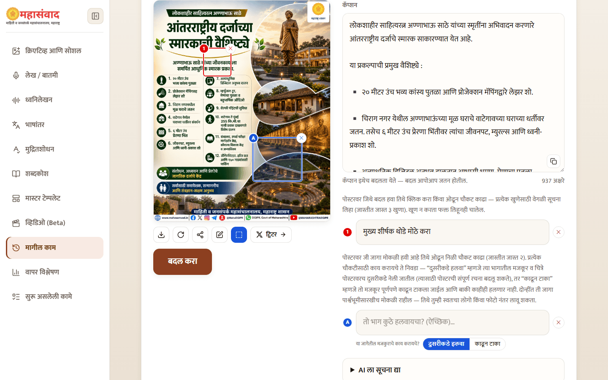

# Improve Results with Feedback

Use feedback when the facts are correct but wording, composition, imagery, or emphasis needs improvement. Correct the source and regenerate when the underlying facts are wrong.

## Change an article

Open **"लेखात बदल हवा आहे?"**. Choose a quick suggestion or write one clear instruction, then select **"बदल करा"**.

Good instructions identify the outcome without introducing a new fact, for example:

- “सुरुवात आणखी थोडक्यात करा.”
- “नागरिकांनी काय करावे हे स्वतंत्र परिच्छेदात मांडा.”
- “भाषा आणखी सोपी करा; नावे आणि आकडे बदलू नका.”

The revised article again receives the required news dateline when applicable.

## Point to a poster element

Select the edit icon labelled **"चित्रात बदल करा (पोस्टरवर खूण करा)"**.

1. Click a point, or drag a small red box, over the element to change.
2. Write a separate instruction for that numbered mark.
3. Add up to three marks.
4. Optionally add one instruction for the whole poster.
5. Select **"बदल करा"**.

The red mark is a pointing gesture, not a crop or mask. The instruction applies to the whole nearby element. Do not mark the software-added official logo or footer; edits in those reserved areas will not be visible.

## Leave space for your own logo or photograph

Select **"जागा मोकळी करा (स्वतःच्या लोगोसाठी)"**, then drag a blue rectangle over the area. You can add up to two rectangles.

For each box choose:

- **"दुसरीकडे हलवा"** — move the existing content elsewhere; the overall composition may change.
- **"काढून टाका"** — delete that content without moving other elements.

The selected area is left as natural background so you can add your own item later. This tool does not upload or place that item for you.

## Request a different visual

The result actions can create a different layout or colour treatment. Use this when the entire direction is unsuitable; use red markers for a local correction. A new visual render can incur image-generation cost.

## Versions

Every successful poster render is kept as an immutable version. Use the version strip to compare, download, or restore an earlier version. Restoring changes which version is current; it does not delete the newer files.


Submitted marker coordinates are not a permanent annotation history. Keep the written instruction specific enough to understand later from the revision record.

