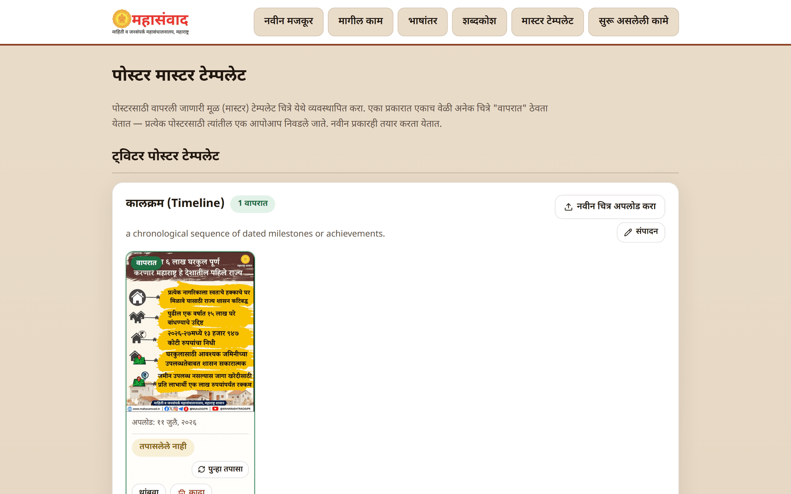
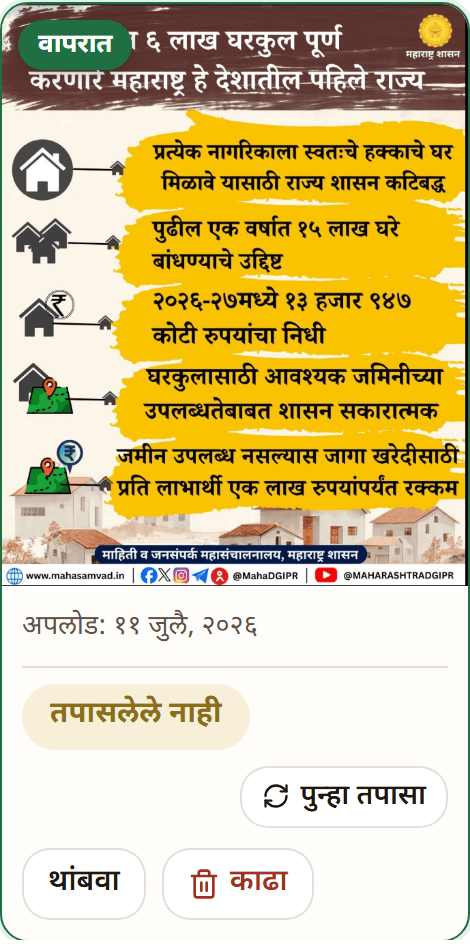
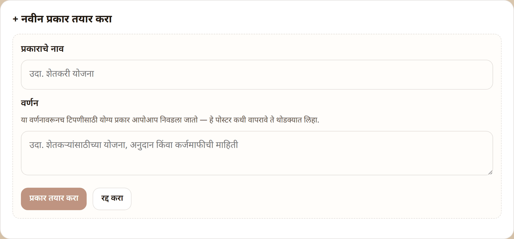

# Master Templates ("मास्टर टेम्पलेट") — Admin

The **"मास्टर टेम्पलेट"** page manages the poster template library — the master images every poster is painted on. It is meant for the team members who own the visual brand; everyday users normally never need it.

The page has two sections:

* **"ट्विटर पोस्टर टेम्पलेट"** — templates for Twitter posts, organised into poster **types** (advisory, scheme info, quote…). The type is what the platform's automatic classifier picks between.
* **"लेख पोस्टर टेम्पलेट"** — the landscape masters used for article posters.

## How rotation works

Within a type, any number of images can be **in use** at once. Every image marked **"वापरात"** (In use) participates; each new poster picks **one of them at random**, so repeated posters of the same type don't all look identical.

On each image tile:

* **"वापरा"** (Use) / **"थांबवा"** (Stop) — add the image to, or remove it from, the rotation. Disabling never deletes anything.
* **"काढा"** (Delete) — permanently removes the image, after the confirmation **"हे चित्र कायमचे काढायचे?"** (Permanently remove this picture?).
* If nothing in a type is enabled, the type card warns **"या प्रकारातील एकही चित्र सध्या वापरात नाही."** — a generation that needs this type will then fail, so keep at least one image enabled per type you use.

## Uploading a new master

Click **"नवीन चित्र अपलोड करा"** (Upload a new picture) on the type it belongs to. PNG, JPEG and WebP are accepted; anything else shows **"कृपया PNG, JPEG किंवा WebP चित्र निवडा."** New uploads start **disabled** — enable them with **"वापरा"** when ready.

## The layout reading — why it matters

When a master is uploaded, the platform **reads its layout from the pixels** and shows the verdict on the tile:

* **"छायाचित्रासह"** (With photograph) — the template has a photo zone; posters made from it may contain a scene photo.
* **"फक्त मजकूर"** (Text only) — the template is purely typographic; the platform will **never paint a photo** onto posters made from it.
* **"तपासलेले नाही"** (Not checked) — not analysed yet; click **"पुन्हा तपासा"**.

This one reading decides whether a generated poster may carry photography at all — a wrong reading quietly produces wrong posters (e.g. an invented photo on a text-only advisory). That's why it's visible on every tile, with two correction tools:

* **"पुन्हा तपासा"** (Re-check) — runs the analysis again (shows **"तपासत आहे…"** while working).
* The flip link — **"“फक्त मजकूर” म्हणून नोंदवा"** (Record as text-only) or **"“छायाचित्रासह” म्हणून नोंदवा"** (Record as with-photograph) — your manual override when the automatic reading is wrong. Your word is final.

## Type name & description ("संपादन")

Each type card shows its description, editable via **"संपादन"** (Edit) → **"जतन करा"** (Save). The description matters: **the automatic classifier reads it** to decide which type suits a note (as the form says: _"या वर्णनावरूनच टिपणीसाठी योग्य प्रकार आपोआप निवडला जातो"_). Describe **when** the poster should be used — it steers type choice and copy tone, not the layout (layout comes from the pixels, above).

## Custom Twitter types ("+ नवीन प्रकार तयार करा")

Your team can add its own poster types to the Twitter section:

1. Click **"+ नवीन प्रकार तयार करा"** (Create a new type).
2. Give it a **"प्रकाराचे नाव"** (Type name — e.g. शेतकरी योजना) and a **"वर्णन"** (Description — when should this poster be used?).
3. Click **"प्रकार तयार करा"** (Create the type), then upload at least one master image to the new card and enable it.

Custom types are tagged **"नवीन प्रकार"** and can be removed with **"प्रकार काढा"** (Delete type) — the confirmation warns that **all of the type's template images are removed with it**: **"हा प्रकार कायमचा काढायचा? यातील सर्व टेम्पलेट चित्रेही काढली जातील."**
