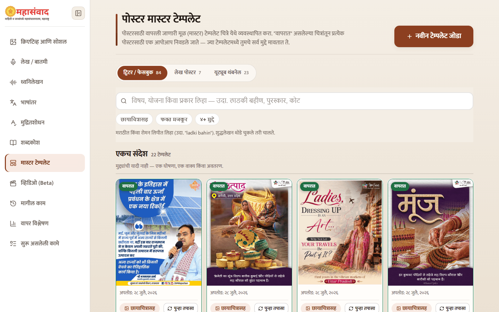
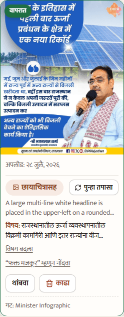

# Master Templates — Admin

**"मास्टर टेम्पलेट"** is the visual reference library used by creative, article-poster, and YouTube-thumbnail generation. It is an administrative workspace.

## Browse the library

Use the tabs for **"ट्विटर / फेसबुक"**, **"लेख पोस्टर"**, and **"यूट्यूब थंबनेल"**. Search by subject, scheme, or template type. Filter templates by photo use, text-only layout, and content capacity.

Templates are grouped by how much information their analysed structure can hold: a single message, a few points, medium content, many points, or not yet analysed. The create form uses this capacity to avoid placing dense source material into a small layout.

## Add a template

1. Select **"नवीन टेम्पलेट जोडा"**.
2. Upload a PNG, JPEG, or WebP image.
3. Choose the intended channel and add a short content description.
4. Save the row and run layout analysis.

Analysis records structure such as photo zones, text regions, and the approximate number of bullet slots. It does not turn words or facts visible in the master into approved source content.

## Review a template tile

An administrator can:

- enable or disable the template for automatic selection;
- rerun layout analysis;
- correct whether the layout is photo-led or text-only;
- edit the content summary;
- delete a wrong or duplicate template.

Disabling is safer than deletion when a template may be needed for audit or later reuse. Deletion is permanent.


Do not upload a template unless the department has the right to reuse its visual structure. Reference logos, text, dates, URLs, QR codes, and factual claims are placeholders and must never be copied into a new poster.

