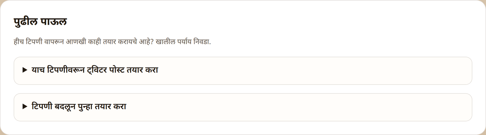
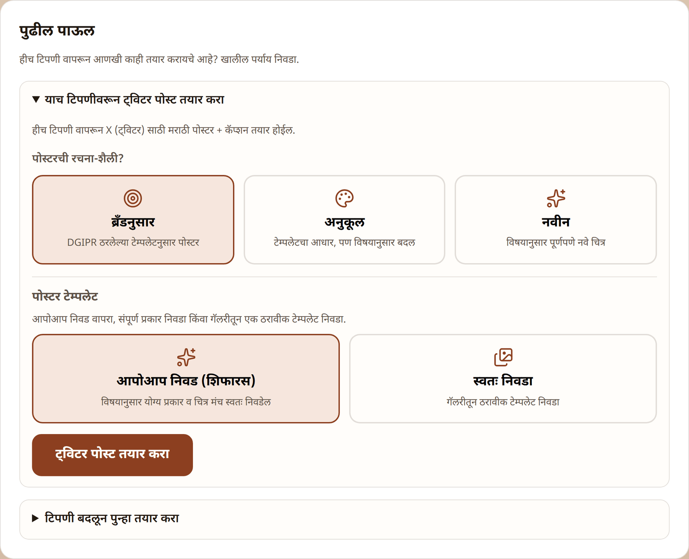
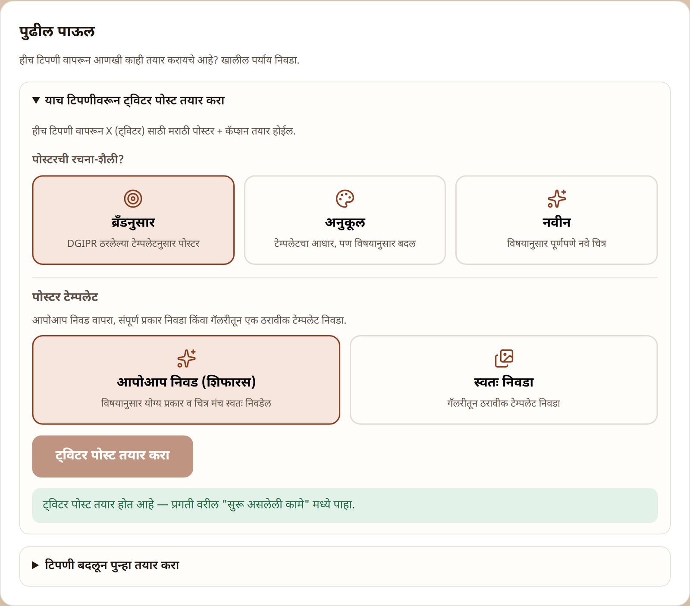
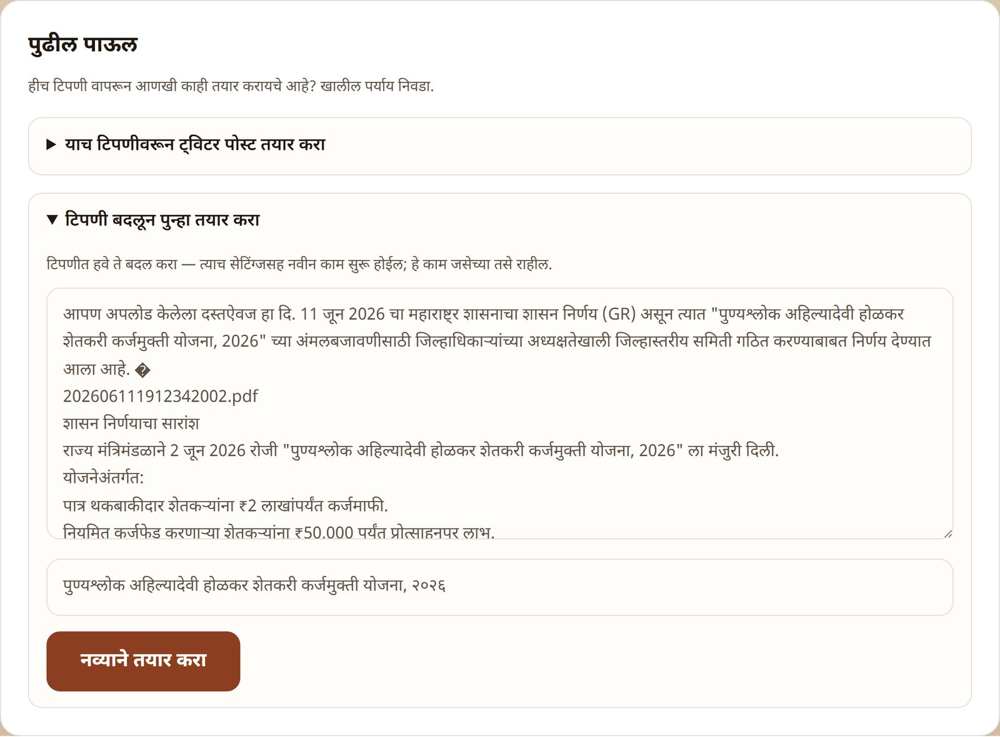
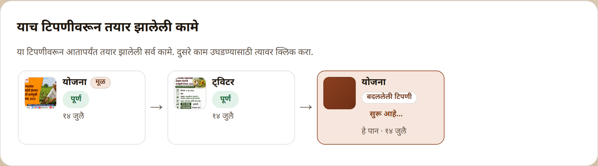
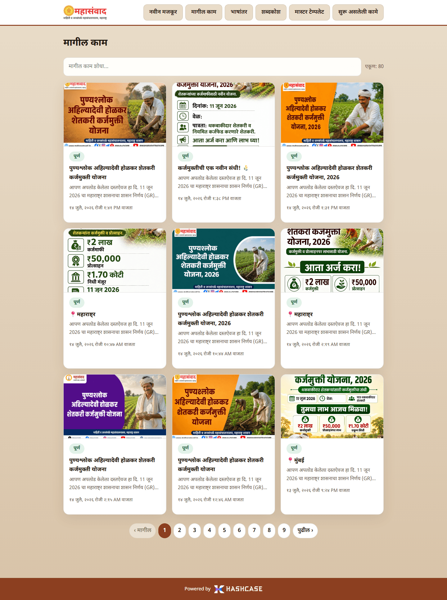
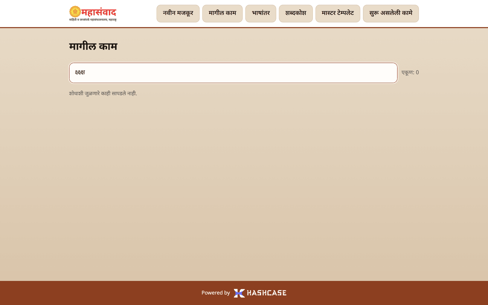

# Journey 5: Next Steps, Threads & History ("मागील काम")

One note rarely produces just one thing. This chapter covers everything the platform offers **after** a run finishes: reusing the note in another format, re-running with an edited note, following a note's family of runs, and finding past work.

## The next-step panel ("पुढील पाऊल")

At the bottom of every finished run's page sits the panel **"पुढील पाऊल"** (Next step). Everything in it creates a **new** run from this run's note — the finished work you are looking at is never modified.

### From an article → a Twitter post

Open **"याच टिपणीवरून ट्विटर पोस्ट तयार करा"** (Create a Twitter post from this same note). Inside the fold you choose the design style and, optionally, a template — the same choices as the home form — then press **"ट्विटर पोस्ट तयार करा"**.

The post starts as a background task: the panel confirms **"ट्विटर पोस्ट तयार होत आहे — प्रगती वरील "सुरू असलेली कामे" मध्ये पाहा."** (_The Twitter post is being created — watch the progress under "Ongoing tasks" above._)

### From a Twitter post → an article

The reverse also works: a finished Twitter run offers **"याच टिपणीवरून लेख तयार करा"** (Create an article from this same note), with the category (**"योजना-लेख"** / **"बातमी"**) and output (**"लेख"** / **"पोस्टर"** / **"दोन्ही"**) choices inside. Pressing **"लेख तयार करा"** opens the new run's progress page.

### Edit the note and re-run

Open **"टिपणी बदलून पुन्हा तयार करा"** (Change the note and create again). The note appears pre-filled and editable — fix a figure, add a paragraph, adjust the heading — then press **"नव्याने तयार करा"** (Create afresh). A new run starts with this run's same settings; the current run stays exactly as it is.


A pinned poster template is deliberately **not** carried over to the re-run — the new run uses automatic template rotation. Pin again inside the fold if you need a specific master.


## The note's thread ("याच टिपणीवरून तयार झालेली कामे")

Once a note has more than one run — follow-ups, retries, edited-note re-runs — every one of those pages shows a rail near the bottom: **"याच टिपणीवरून तयार झालेली कामे"** (Work created from this same note).

* Runs appear oldest → newest, joined by arrows.
* **"मूळ"** (Original) marks the first run of the note.
* **"बदललेली टिपणी"** (Changed note) marks a run whose note was edited before re-running.
* **"हे पान"** (This page) marks the run you are currently viewing — the highlighted node.
* Click any other node to open that run.

## History ("मागील काम")

**"मागील काम"** in the menu lists everything ever created, newest first — this is the permanent record (unlike the session-only tasks panel).

* Each card shows the poster thumbnail (or a coloured banner with the category — **योजना / बातमी / ट्विटर**), the status chip, the headline, a snippet of the note, and the date. Click a card to open the run.
* **Search** with **"मागील काम शोधा…"** (Search past work) — it matches headlines and note text as you type, with a live count (**"एकूण: N"**).

* No matches shows **"शोधाशी जुळणारे काही सापडले नाही."** (Nothing matching the search was found.)

* With more than nine items, page controls appear at the bottom: **"‹ मागील"** (Previous), numbered pages, **"पुढील ›"** (Next).

Status chips you will see on cards: **"रांगेत"** (Queued), **"सुरू आहे…"** (Running), **"पूर्ण"** (Done), **"अयशस्वी"** (Failed).
