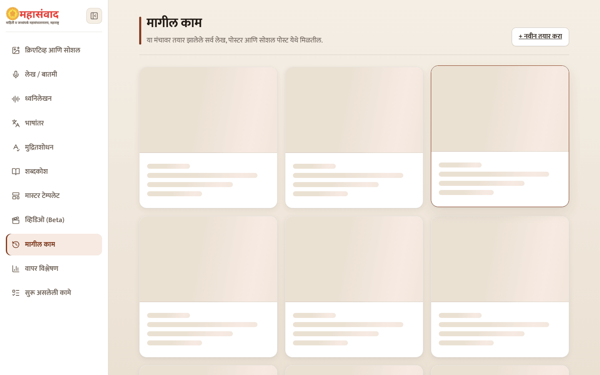

# Ongoing Tasks, Reuse & History

The platform separates temporary task monitoring from permanent saved work.

## Ongoing tasks

Select **"सुरू असलेली कामे"** to see background generations. A task can be opened while it is running or after it completes.

Closing the panel or visiting another page does not cancel a task. A browser refresh reconnects to server-side generation work; file-selection controls that had not yet been submitted may need to be selected again.

## Reuse approved material

From a result page you may see follow-up actions such as:

- **"याच मजकुरावरून ट्विटर पोस्ट तयार करा"**;
- **"याच मजकुरावरून फेसबुक पोस्ट तयार करा"**;
- **"टिपणी बदलून पुन्हा तयार करा"**;
- **"याच स्रोतातून पुन्हा लेख तयार करा"** on a DLO article.

These actions link related generations in a thread. Use them when the factual source remains valid. If the official source has changed, create a new intake so the audit trail does not imply that an old source supported a new fact.

## Browse saved work

Open **"मागील काम"**. The grid shows saved articles, posters, social posts, thumbnails, and related generations.

- Search by headline or source-note text.
- Select a card to reopen its result.
- Use the page controls to move through older records; nine results are shown per page.
- Clear the search if no result appears.

Ad-hoc translation and proofreading text does not appear here. Temporary document-intake jobs also expire rather than becoming history.


History records the generated work and its versions; it is not a substitute for your department's records-management or publication-approval process.

