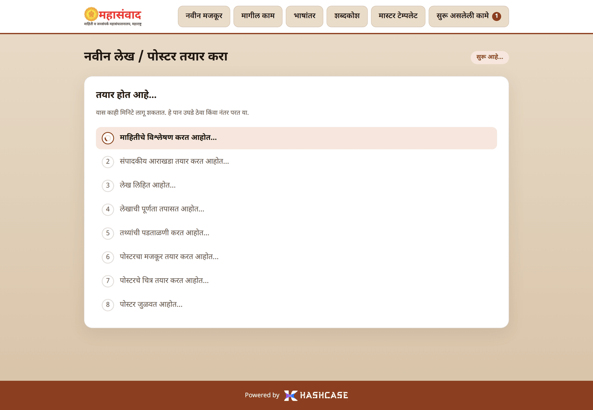
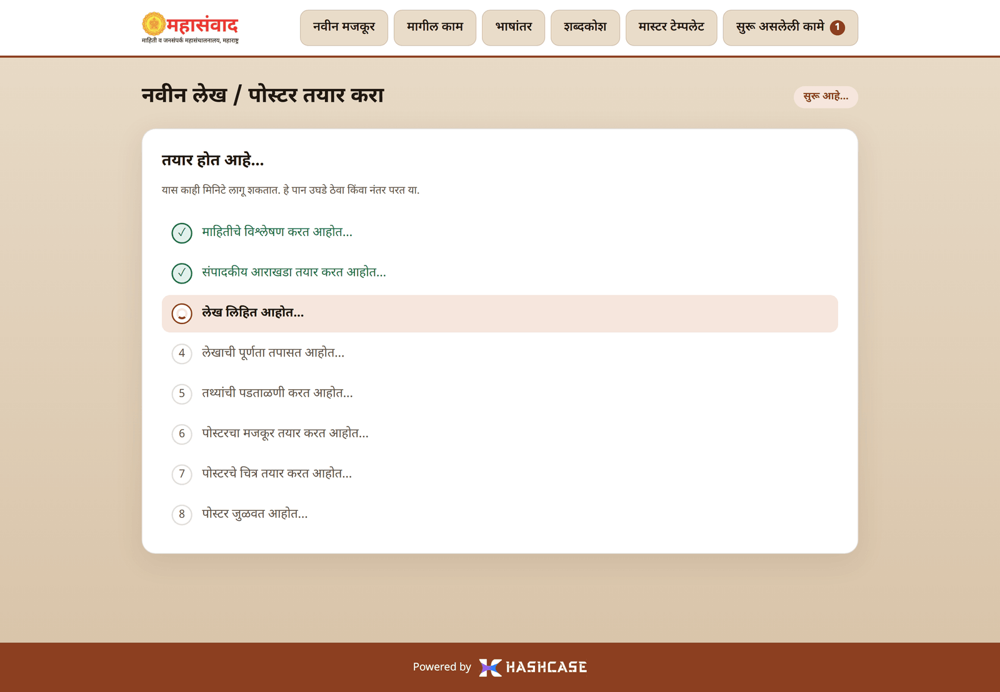
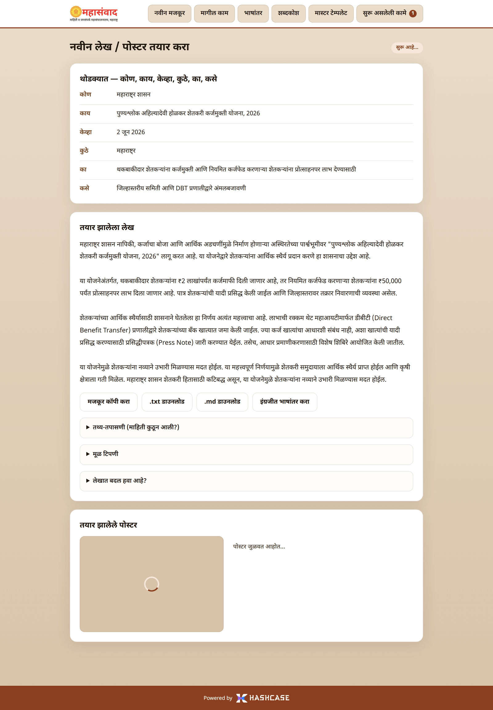
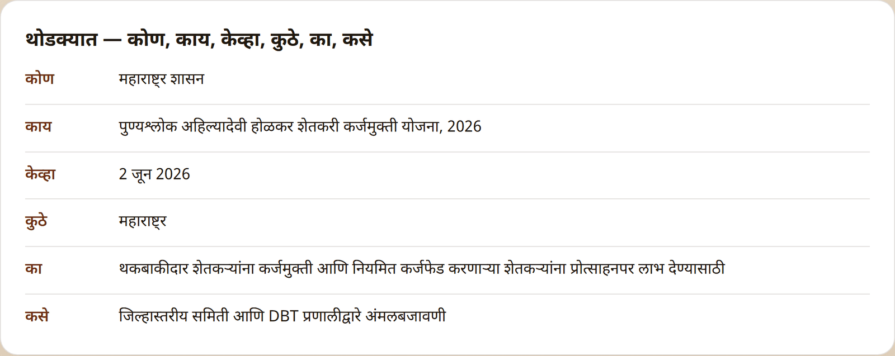
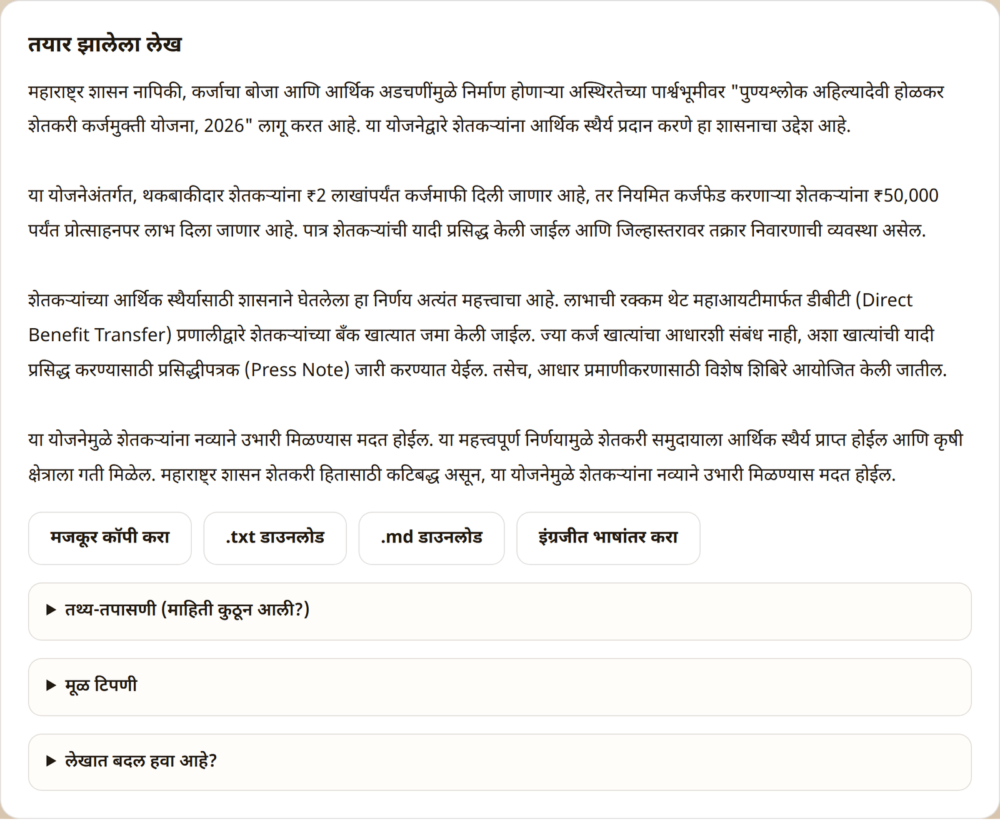
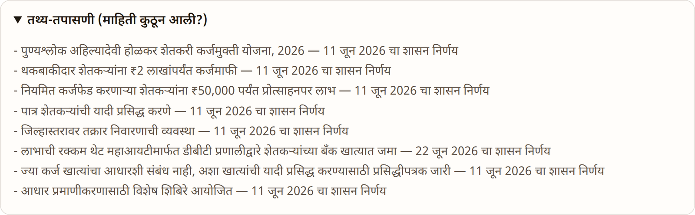
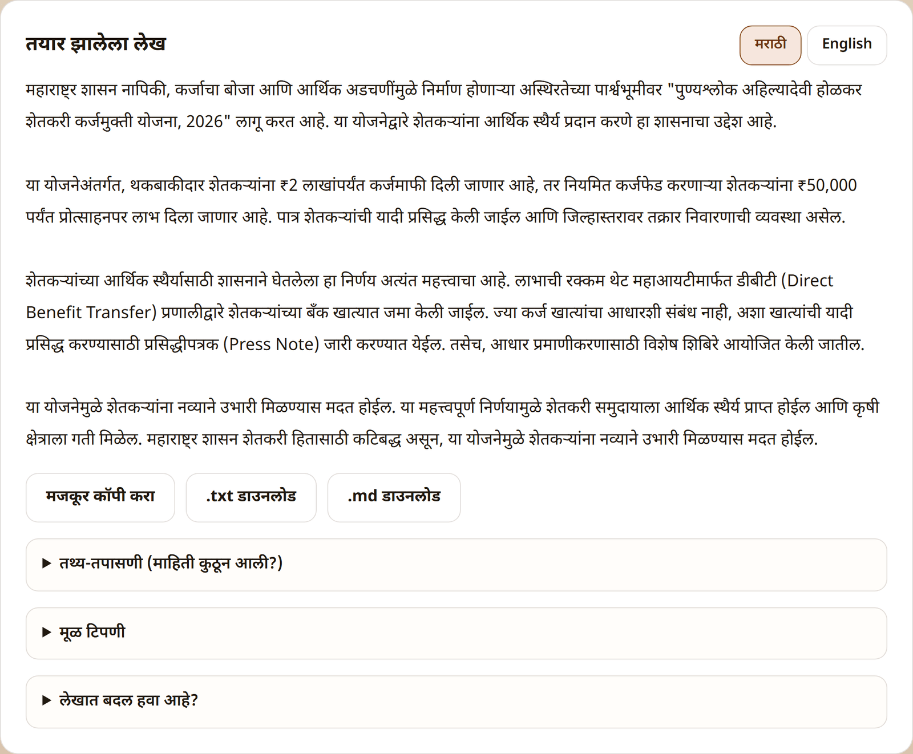
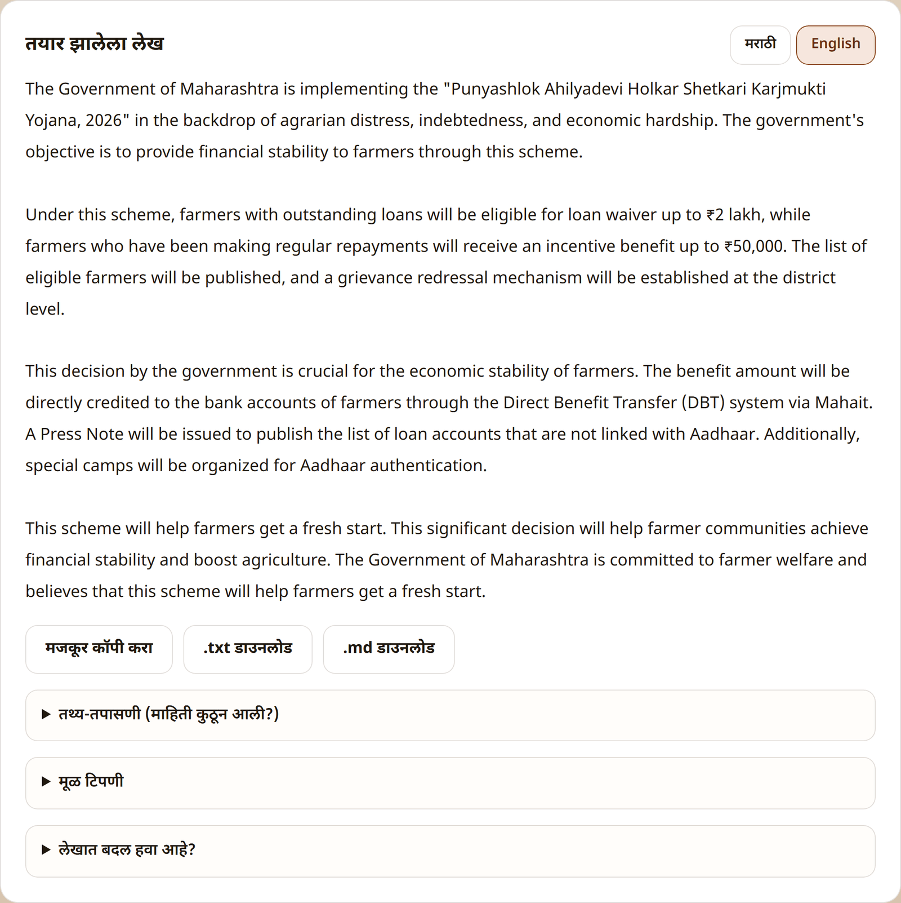
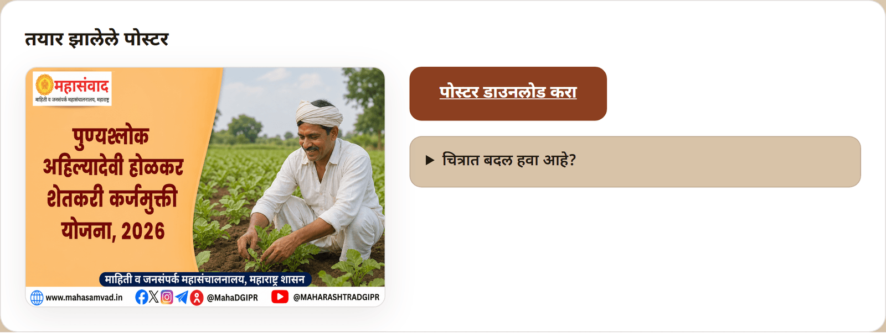

# Journey 2: Watch Progress & Read Your Results

After you press **"तयार करा →"**, the platform opens the work's own page. This page is permanent — you can bookmark it, refresh it, or come back later from **"मागील काम"** (Past work); the run continues on the server either way.

## The progress steps

While the work runs, the page shows **"तयार होत आहे…"** (Being created…) with a live step list. Finished steps get a ✓, the current step shows a spinner.

The steps, in order:

| Step shown                           | What is happening                                                      |
| ------------------------------------ | ---------------------------------------------------------------------- |
| **"संदर्भ लेख शोधत आहोत…"**          | Finding Mahasamvad style references for this topic                     |
| **"माहितीचे विश्लेषण करत आहोत…"**    | Extracting the who/what/when/where/why/how from your note              |
| **"संपादकीय आराखडा तयार करत आहोत…"** | Building the editorial brief — deciding the angle and which facts lead |
| **"लेख लिहित आहोत…"**                | Writing the article (the longest step)                                 |
| **"लेखाची पूर्णता तपासत आहोत…"**     | Checking nothing important from the note was dropped                   |
| **"तथ्यांची पडताळणी करत आहोत…"**     | Verifying every fact against your note                                 |
| **"पोस्टरचा मजकूर तयार करत आहोत…"**  | _(poster runs)_ Writing the poster text                                |
| **"पोस्टरचे चित्र तयार करत आहोत…"**  | _(poster runs)_ Painting the poster image                              |
| **"पोस्टर जुळवत आहोत…"**             | _(poster runs)_ Assembling the final poster                            |

A full run typically takes **several minutes**. As the page itself says: **"यास काही मिनिटे लागू शकतात. हे पान उघडे ठेवा किंवा नंतर परत या."** (_This can take a few minutes. Keep this page open, or come back later._)


You don't have to watch. Navigate anywhere — the run appears in **"सुरू असलेली कामे"** (Ongoing tasks) with its live step, and clicking that row brings you back.


## The article appears before the poster

On a **"दोन्ही"** (Both) run the finished article is shown as soon as it is ready, while the poster is still being painted — the poster's spot shows a shimmering placeholder labelled **"पोस्टर तयार होत आहे…"** (The poster is being prepared…). You can already read, copy, and even send feedback on the article during this phase.

## The at-a-glance summary (5W1H)

Above the article, the card **"थोडक्यात — कोण, काय, केव्हा, कुठे, का, कसे"** (In brief — who, what, when, where, why, how) summarises the note's key facts. A field the note does not mention shows **"या टिपणीत नमूद नाही"** (Not mentioned in this note).

## The finished article ("तयार झालेला लेख")

Below the article text:

* **"मजकूर कॉपी करा"** (Copy text) — copies the article to the clipboard; the button briefly reads **"कॉपी झाले ✓"** (Copied ✓).
* **".txt डाउनलोड"** / **".md डाउनलोड"** — download the article as a plain-text or Markdown file.
* **"इंग्रजीत भाषांतर करा"** (Translate to English) — see below.
* **"तथ्य-तपासणी (माहिती कुठून आली?)"** (Fact check — where did the information come from?) — a fold-out showing, claim by claim, where each fact in the article originates. Open it whenever you want to verify the article against the note.
* **"मूळ टिपणी"** (Original note) — a fold-out with the exact note this run was created from.

### English translation of the article

Click **"इंग्रजीत भाषांतर करा"** and the platform translates the article using the verified [name glossary](glossary.md), so official names and designations come out right. While it works you'll see **"भाषांतर सुरू आहे…"** (Translation in progress…):

When done, a **मराठी / English** toggle appears next to the article heading. The copy and download buttons follow whichever language is currently shown.

## The finished poster ("तयार झालेले पोस्टर")

* **"पोस्टर डाउनलोड करा"** (Download poster) — downloads the poster as a PNG, ready to publish.
* **"चित्रात बदल हवा आहे?"** (Want a change in the picture?) — send visual feedback; covered in [Journey 3](improve-with-feedback.md).

The article poster is deliberately simple: one strong Marathi headline over a scene image, in the DGIPR frame — designed to sit alongside the article, distinct from the busier Twitter posters.

## If a run fails

A failed run shows **"काम अपूर्ण राहिले"** (The work was left incomplete) with the reason, and a **"पुन्हा प्रयत्न करा"** (Try again) button that starts a fresh run from the same inputs. The new run is linked to the old one in the note's thread ([Journey 5](next-steps-and-history.md)).
