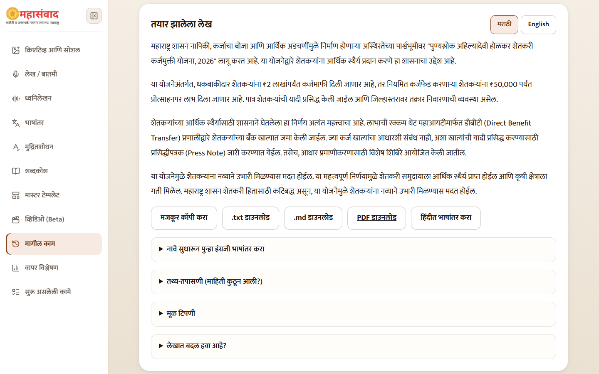
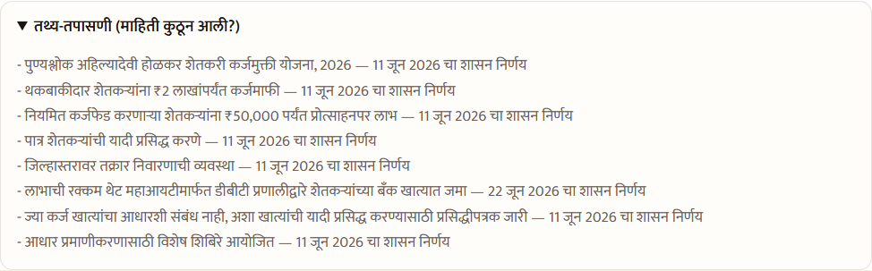
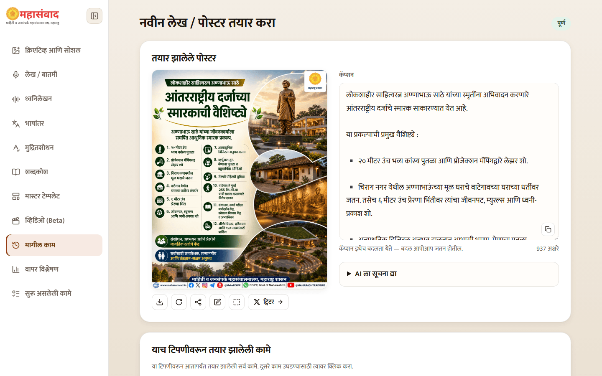

# Progress, Results, Downloads & Translation

Generation work continues after the result page opens. A live progress area shows the current phase; you may leave the page and return through **"सुरू असलेली कामे"** or **"मागील काम"**.

## Article result

The article card is available as soon as writing and verification finish. Read the full Marathi article on screen.

Available article actions include:

- **"मजकूर कॉपी करा"**;
- TXT and Markdown downloads;
- a publication-ready PDF download;
- English and Hindi translation;
- article feedback.

When more than one language exists, use the **"मराठी"**, **"English"**, and **"हिंदी"** tabs to switch the visible article. English and Hindi are stored separately, so creating one does not replace the other.

Before either translation begins, the platform asks you to review names. The English run uses the approved English spelling. The Hindi run uses the approved Hindi spelling and lets you decide whether each proper name should remain exactly as entered. See [Translate Text and Documents](translation.md) for the full name-review rules.

## Verification sections

Open **"तथ्य-तपासणी (माहिती कुठून आली?)"** to compare important claims with their source coverage. Open **"मूळ टिपणी"** to see the source note used for the run.


A green or complete-looking result is not publication approval. Check every named person, designation, date, amount, quotation, eligibility rule, and action against the official source.


## Poster, thumbnail, or social result

The visual appears with its caption, if one was requested. The icon row provides download, redesign/recolour where supported, publishing, point-feedback, and free-space tools.

If the article becomes ready before its poster, the article remains usable while the poster card shows that rendering is still in progress. Refreshing is not required.

## If a task fails

The result page keeps any part that already finished successfully and shows the failure beside the affected part. Use the offered retry only for the missing or failed operation; do not start the whole journey again unless the source itself must change.
