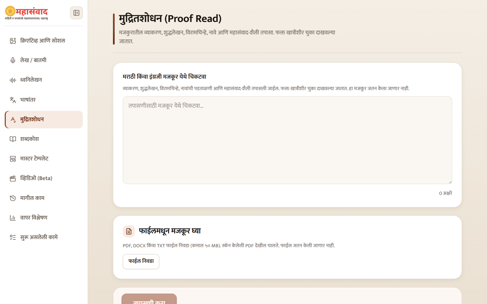
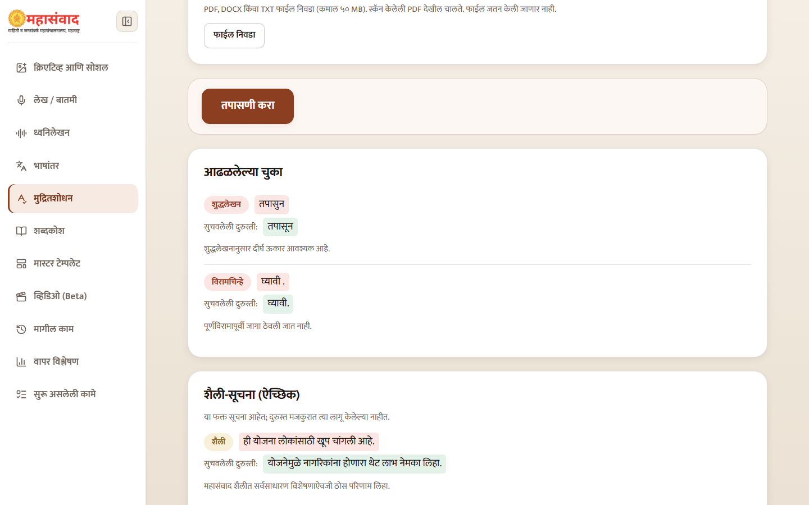
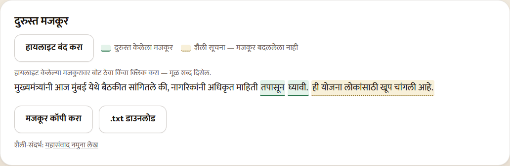

# Proofread Marathi or English

Use **"मुद्रितशोधन"** to check pasted text or an uploaded PDF, DOCX, or TXT file. The source and result are not stored as a permanent generation.

## Run the check

1. Paste Marathi or English text, or select **"फाईल निवडा"**.
2. For a PDF, select pages before OCR and review the extracted text as described in [Translate Text and Documents](translation.md).
3. Select **"तपासणी करा"**.

The checker looks for high-confidence grammar, spelling, punctuation, and verified-name errors. Marathi text is also compared with Mahasamvad style; English text is not.

## Read the findings

Confirmed errors appear under **"आढळलेल्या चुका"**, grouped by type. Each row shows the original excerpt, **"सुचवलेली दुरुस्ती:"**, and a short explanation.

Style recommendations appear separately under **"शैली-सूचना (ऐच्छिक)"**. They are advice only and are not automatically applied. Names that do not match the verified glossary are shown for manual confirmation and are not silently corrected.

## Use the corrected text

The **"दुरुस्त मजकूर"** card applies confirmed error-level corrections. Use the highlight toggle to show or hide changes; click or hover a highlight to see the original text and explanation.

Select **"मजकूर कॉपी करा"** or download the TXT file. If the numeric-preservation guard detects that a proposed fix would change a number, the platform withholds corrected text and shows the issues only—make that correction manually against the source.


Proofreading does not fact-check the document. A grammatically clean sentence can still contain the wrong name, date, amount, designation, or policy claim.

