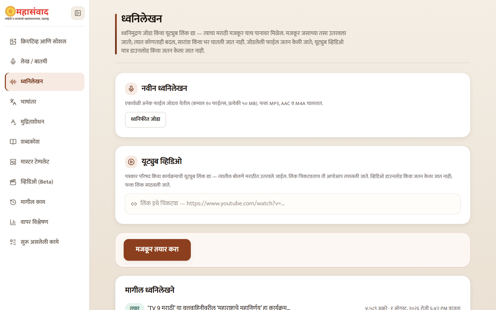
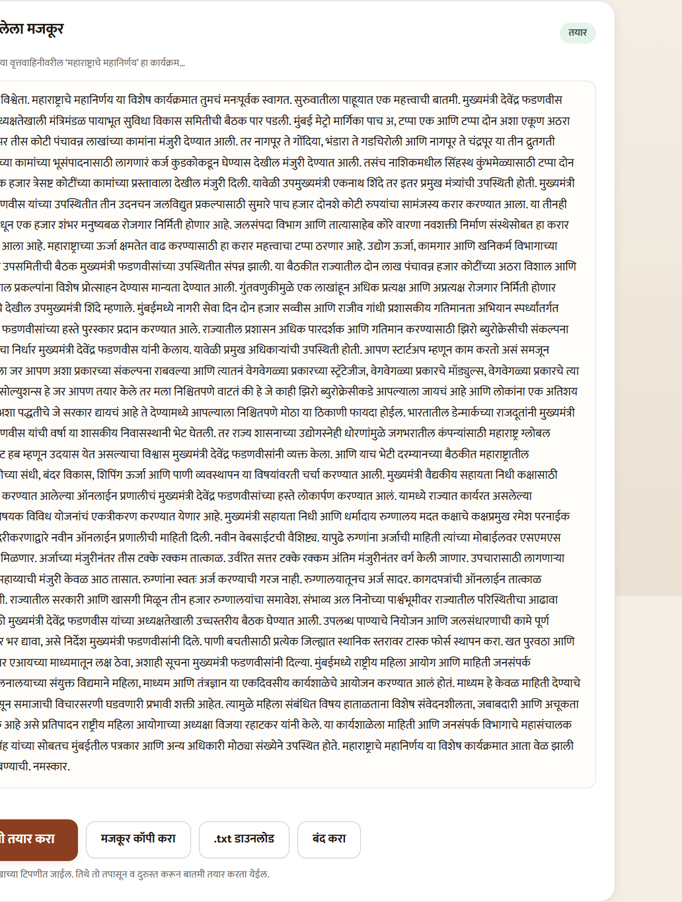

# Transcribe Audio and YouTube

Use **"ध्वनिलेखन"** when you need an exact transcript before deciding what to create from it.

## Start a transcript

1. Select **"ध्वनिफीत जोडा"** for audio files, and/or paste YouTube links in the link box. You may add up to ten YouTube links in one run.
2. Check that every listed source is intended for this transcript.
3. Select **"मजकूर तयार करा"**.

The newest and previous runs appear on the same page. Select a row to open its result inline.

Uploaded audio is saved with the transcription record so the run can be reopened. A YouTube video is not downloaded or stored; its link and resulting transcript are kept.

## Use the result

The transcript is read-only because it represents what the speech service heard. You can:

- select **"मजकूर कॉपी करा"**;
- download a TXT file;
- see which individual audio or YouTube source failed;
- select **"बातमी तयार करा"** to send the transcript into **"लेख / बातमी"** as a draft.

Using **"बातमी तयार करा"** does not transcribe the source again. Review and correct names, numbers, quotations, and code-mixed words in the article intake before generation.


Audio transcription is not a verified quotation record. Compare sensitive statements with the recording, especially names, designations, dates, amounts, and English terms spoken in Marathi sentences.

