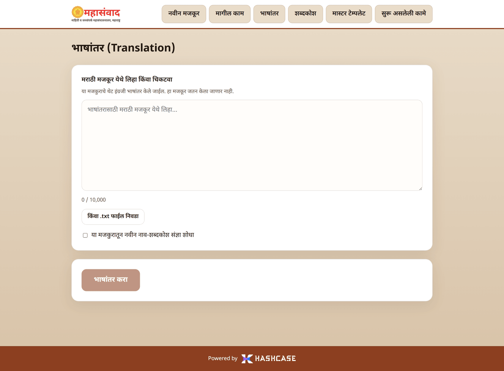
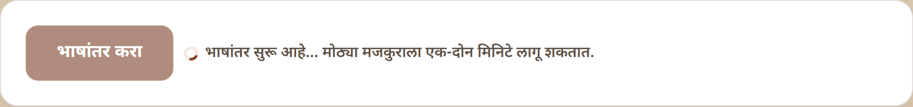
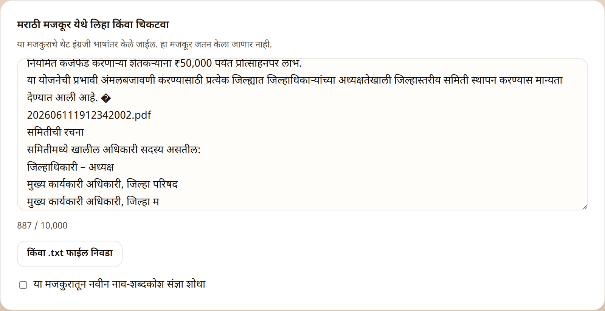

# Translation ("भाषांतर")

The **"भाषांतर"** page translates any Marathi text to **English or Hindi** — independent of articles. Use it for letters, notes, press material, anything. It uses the same verified [name glossary](glossary.md) as article translation, so official names, designations, scheme names and places come out correctly and consistently.

## Translating a text

1. Type or paste the Marathi text into **"मराठी मजकूर येथे लिहा किंवा चिकटवा"** (Write or paste Marathi text here) — or load it with **"किंवा .txt फाईल निवडा"** (Or choose a .txt file).
2. Watch the counter below the box: up to **10,000 characters** per translation. Over the limit the counter turns red with **"मजकूर १०,००० अक्षरांपेक्षा जास्त आहे."** (The text exceeds 10,000 characters.)
3. Optional: tick **"या मजकुरातून नवीन नाव-शब्दकोश संज्ञा शोधा"** (Find new glossary terms from this text). The translation will then also collect names it encountered and add them to the [glossary](glossary.md) for your team to review — this is how the dictionary grows.
4. Under **"कोणत्या भाषेत भाषांतर हवे?"** (Which language do you want?) pick **"इंग्रजी"** (English) or **"हिंदी"** (Hindi). Changing this clears any result already on screen.
5. Click **"भाषांतर करा"** (Translate). While it works you'll see **"भाषांतर सुरू आहे… मोठ्या मजकुराला एक-दोन मिनिटे लागू शकतात."** (_Translation in progress… large texts can take a minute or two._)

## The result ("इंग्रजी भाषांतर" / "हिंदी भाषांतर")

- **"मजकूर कॉपी करा"** (Copy text) — copies the English text; the button briefly shows **"कॉपी झाले ✓"**.
- **".txt डाउनलोड"** — downloads the English text as a file.
- The line below reports how the glossary was used: **"N शब्दकोश संज्ञा वापरल्या"** (N glossary terms applied), and — if mining was ticked — **"M नवीन संज्ञा तपासणीसाठी जोडल्या"** (M new terms added for review).


Text translated here is **not saved** anywhere — the page itself says so: **"हा मजकूर जतन केला जाणार नाही."** (This text will not be stored.) Copy or download the result before leaving the page.



If a name comes out wrong in English, don't fix it by hand every time — fix it **once** in the [glossary](glossary.md) and verify it. Every future translation will then use your spelling.


## About Hindi

Hindi uses the same Devanagari script as Marathi, so a Hindi translation looks deceptively similar to the original — but the grammar, verb forms and much of the vocabulary do change.

Names are handled differently from English, and the name-check step says so: **a person, place, organisation or scheme name in the glossary is kept exactly as it is written in Marathi** (वाघ stays वाघ, never बाघ; कोल्हापूर stays कोल्हापूर). The English spelling you confirm in the name check is not used in the Hindi text at all — it is saved to the [glossary](glossary.md) for future English translations. **Designations are translated** (जिल्हाधिकारी becomes जिलाधिकारी), because those are ordinary words rather than names.

This means the glossary decides which words are frozen. If a place or scheme name comes out re-spelt in Hindi, add it to the glossary with the right type and it will be locked from then on.

Figures stay in Devanagari digits (५००, २ कोटी), matching the Marathi original.

## Translating a whole PDF ("PDF फाईल")

At the top of the page, switch from **"मजकूर"** (Text) to **"PDF फाईल"** to translate a complete document — a booklet of articles, a compiled press file, a scanned circular. This mode has no 10,000-character limit: it works page by page, in the background.

1. Click **"PDF निवडा"** (Choose PDF) and pick the file (up to **25 MB**). Scanned PDFs are fine — the text is read with OCR.
2. **"PDF मधील मजकूर वाचत आहोत…"** (Reading the text from the PDF) appears while the document is processed. Depending on the number of pages and the quality of the scan this takes **3 to 10 minutes**. Keep the page open; if you refresh by accident, the page reconnects to the same job.
3. Every page then appears as its own row with its character count and a **मराठी** / **English** badge. All pages are selected to begin with.
   - Untick any page you don't want translated.
   - **"मजकूर पाहा / दुरुस्त करा"** (View / correct text) opens that page's text so you can fix an OCR mistake in a name or a figure **before** it is translated. A corrected page is marked **"दुरुस्त केले"**.
4. Optional: type a plain instruction under **"AI सूचना (ऐच्छिक)"** — for example **"फक्त पृष्ठ १ ते ९ भाषांतरित करा"** (Translate only pages 1 to 9) or **"शेवटची दोन पाने वगळा"** (Skip the last two pages) — and click **"सूचना लागू करा"**. The instruction only decides **which pages are ticked**; you can always adjust the ticks afterwards. It never changes the wording of the translation.
5. Under **"कोणत्या भाषांमध्ये भाषांतर हवे?"** pick **इंग्रजी**, **हिंदी**, or **both** — both languages are produced in the same run.
6. Click **"नावे तपासा"** (Check the names) and confirm the name list exactly as in the text mode. On a long document there can be many names; already-verified ones are folded away behind **"आधीच तपासलेली नावे दाखवा"** so only the ones needing attention are in front of you.
7. The translation then runs in the background, reporting **which language and which page** it is on. The result appears page by page, with a tab per language, a **"संपूर्ण मजकूर कॉपी करा"** button and a **".txt"** download.


**English pages inside a Marathi document** are handled for you. For the English translation such a page is kept **exactly as it is** — it is already English, so nothing is re-written. For the Hindi translation it is translated from English. Pages the system passed through are marked in the result.



The uploaded PDF is **not stored** — it is read once and discarded, and the job disappears about an hour after you finish. Download the translations before you leave. If the page reports **"ही फाईल आता उपलब्ध नाही"** (This file is no longer available), the job has expired or the server was restarted; upload the PDF again.

