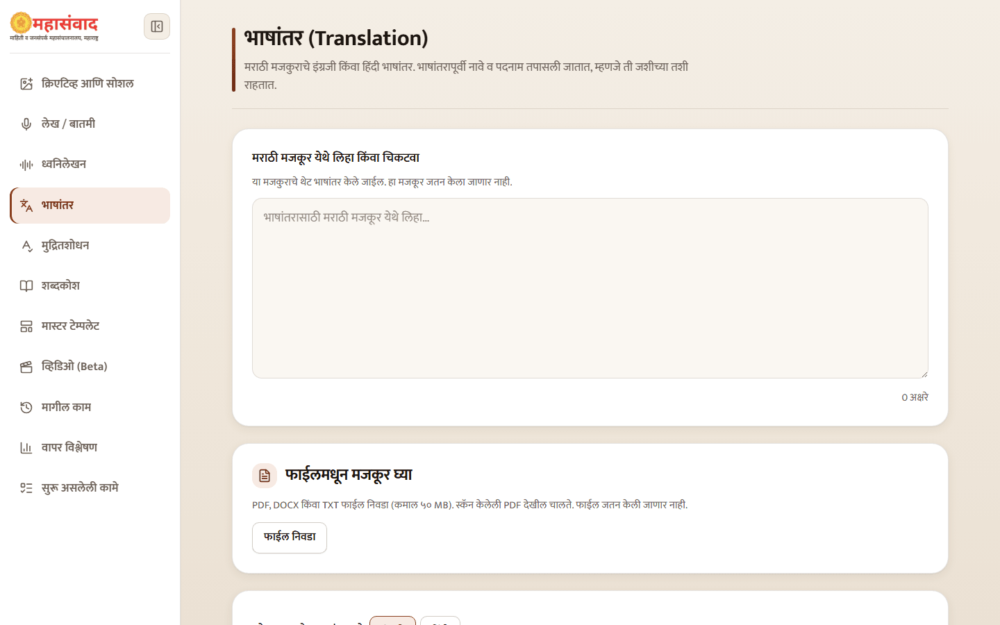
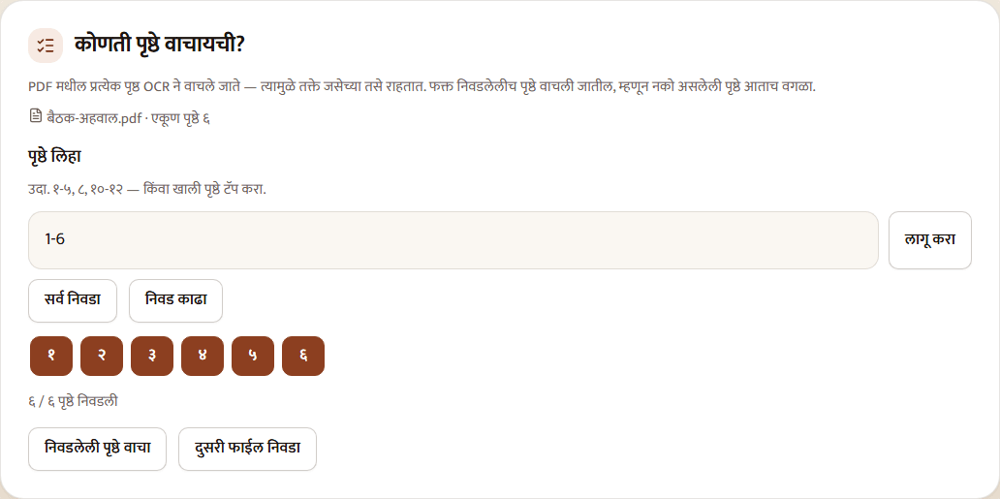
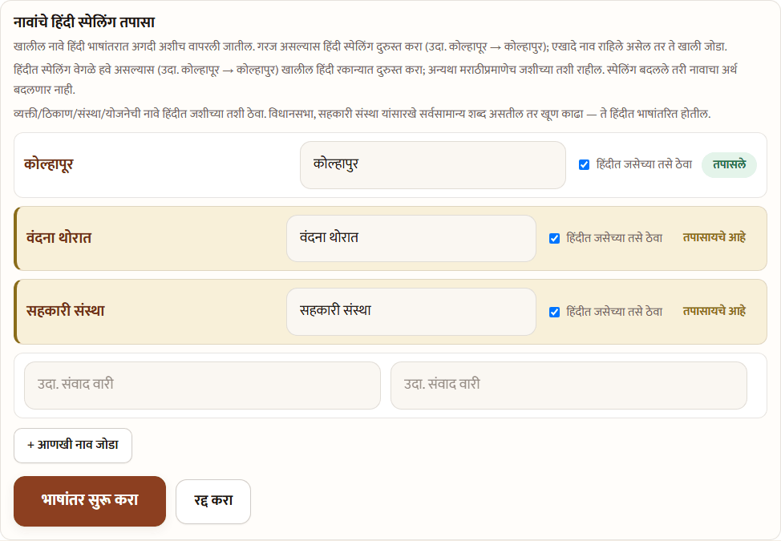
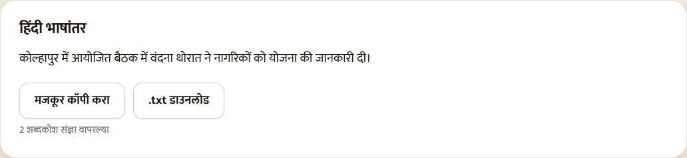

# Translate Text and Documents

Use **"भाषांतर"** for ad-hoc Marathi-to-English or Marathi-to-Hindi translation. The text and uploaded file are not saved as a permanent generation.

## Translate pasted text

1. Paste the source under **"मराठी मजकूर येथे लिहा किंवा चिकटवा"**.
2. Choose **"इंग्रजी"** or **"हिंदी"**.
3. Select **"भाषांतर करा"**.
4. Review the detected names before translation begins.

The result can be copied or downloaded as TXT.

## Translate a PDF, DOCX, or TXT file

Select **"फाईल निवडा"** under the upload card.

- TXT and DOCX files are extracted and go directly to text review.
- Every PDF stops at page selection. Tick only the pages you need, then start reading them. Only selected pages are sent to OCR so table columns can be preserved.

The page review identifies text read from the file or by OCR. Edit any extraction mistakes before choosing **"हा मजकूर वापरा"**. PDF text is OCR output and therefore needs special scrutiny for names and numbers.


OCR is a paid, page-based service. Page selection is the spend approval point: exclude covers, blank pages, pages you do not need, and annexures that should not be translated.


The temporary document job is kept only for a limited time and may survive a page refresh in the same browser session. If the API restarts or the job expires, upload the file again.

## Review names before translating

The platform extracts people, places, organisations, schemes, and other likely proper names. Check every row.

For an English translation:

- confirm or correct the English spelling;
- add a missing name with **"+ आणखी नाव जोडा"**.

For a Hindi translation:

- confirm or correct the Hindi spelling;
- keep **"हिंदीत जसेच्या तसे ठेवा"** selected only for a proper name that must remain exact;
- untick it for a common noun or designation that should be translated naturally.

Rows marked **"तपासले"** already match a verified glossary entry. Rows marked **"तपासायचे आहे"** still require officer review. Confirmed spellings can become verified glossary entries for future work.

Select **"भाषांतर सुरू करा"** after review, or **"रद्द करा"** to return without translating.

## Hindi name warnings

Hindi translation uses a dedicated translation service. After translation, the platform tries to enforce approved proper-name spellings. If a name still cannot be accounted for, the translated text is delivered with a warning instead of being discarded.

Compare every warned name with the source and correct it before publication. Do not rerun the whole document merely to clear a warning if the text is otherwise usable.
