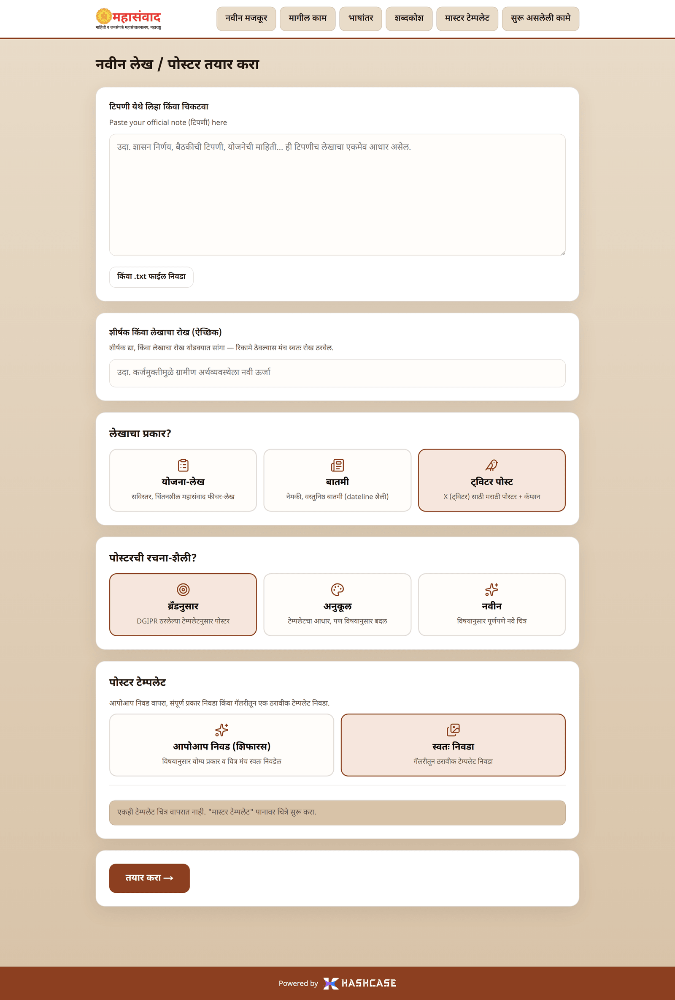
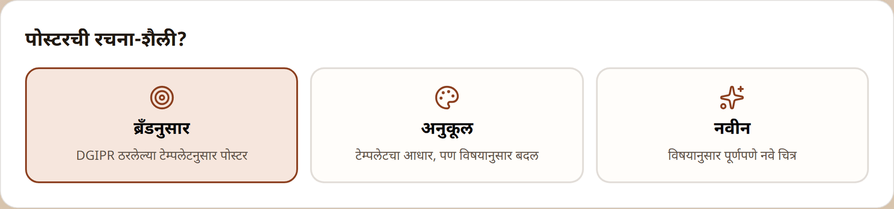
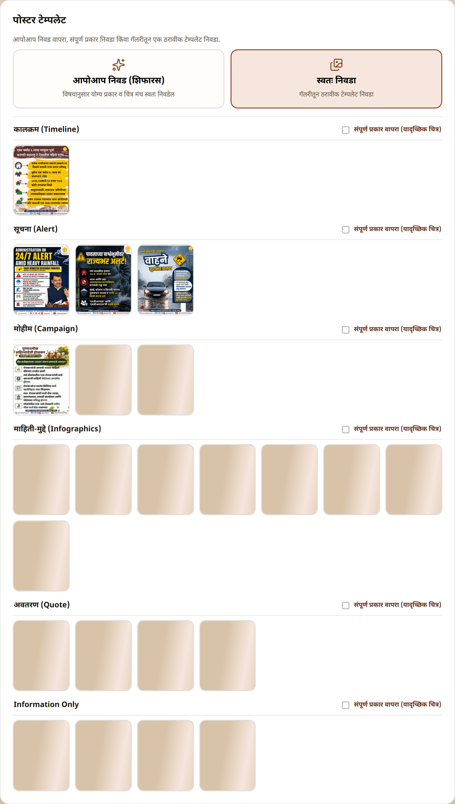
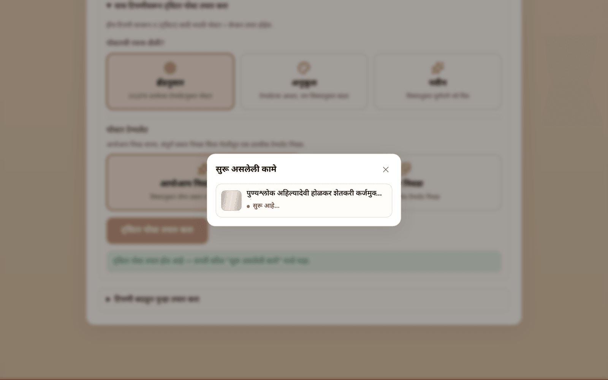
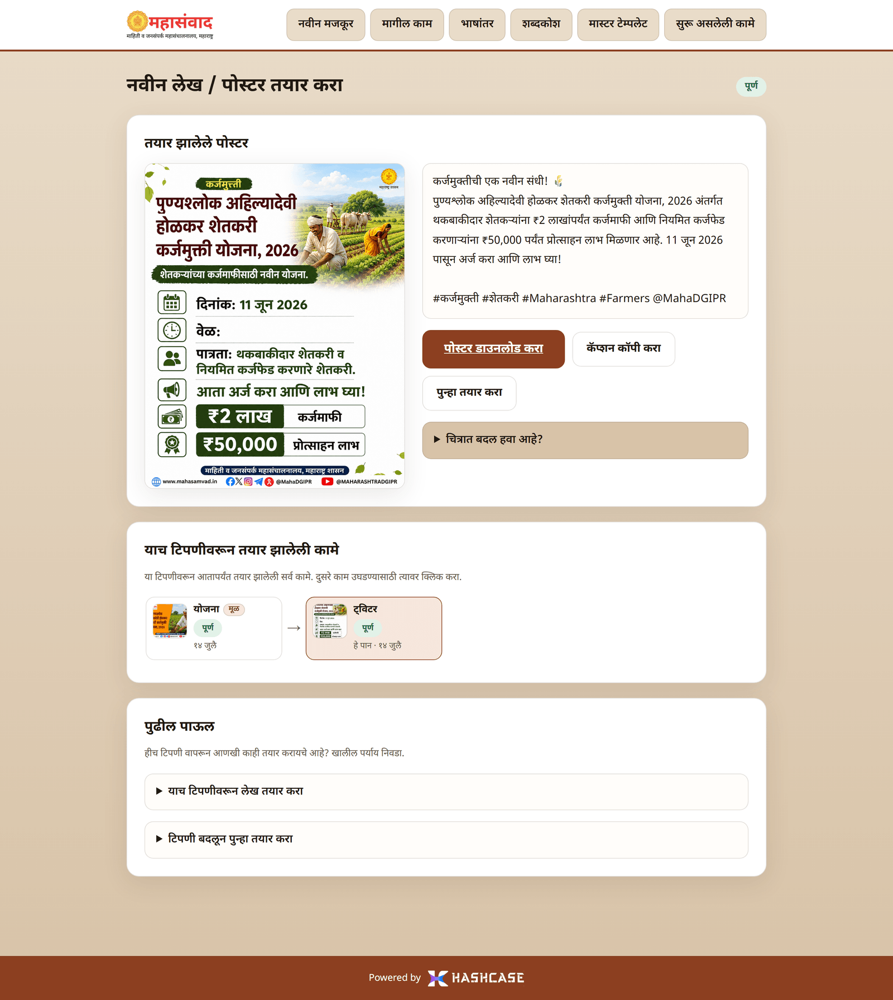
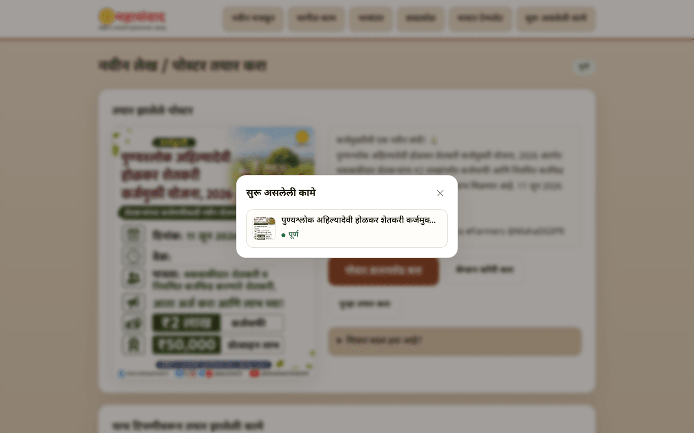
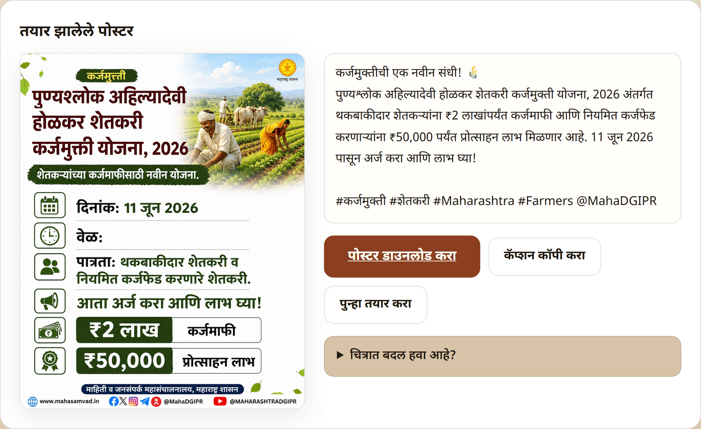

# Journey 4: Twitter Posts ("ट्विटर पोस्ट")

A Twitter run produces a **square Marathi poster** in the DGIPR brand plus a **ready-to-paste caption** for X (Twitter). It behaves differently from an article run in one important way: it runs **in the background** — the page does not change when you start it. You follow it from the **"सुरू असलेली कामे"** (Ongoing tasks) panel.

## Starting a Twitter post

On the create form, pick **"ट्विटर पोस्ट"** as the content type. The form changes:

### Design style ("पोस्टरची रचना-शैली?")

| Style                       | What it means                                      |
| --------------------------- | -------------------------------------------------- |
| **"ब्रँडनुसार"** (On-brand) | Strictly follows a DGIPR master template           |
| **"अनुकूल"** (Adaptive)     | Uses a template as the base, adapted to the topic  |
| **"नवीन"** (Fresh)          | A completely new image for the topic — no template |

### Poster template ("पोस्टर टेम्पलेट")

For **"ब्रँडनुसार"** and **"अनुकूल"**, the template picker offers the **Twitter** template library, grouped by poster type (advisory, scheme information, quote, and so on — including any custom types your team has created):

* Leave it on **"आपोआप निवड (शिफारस)"** and the platform reads your note and picks the right poster type itself.
* Or pin one exact image, or a whole type via **"संपूर्ण प्रकार वापरा (यादृच्छिक चित्र)"** — exactly as described in [Journey 1](create-content.md#step-5--poster-template-पोसटर-टमपलट).

Press **"तयार करा →"**. The tasks panel opens by itself, the form resets, and the run continues in the background.

## Following the run

Open **"सुरू असलेली कामे"** any time — the run shows a pulsing dot and its live step:

The steps a Twitter run goes through: **"विषय ओळखत आहोत…"** (identifying the topic) → **"पोस्टरचा मजकूर तयार करत आहोत…"** (writing the poster text) → **"पोस्टरचे चित्र तयार करत आहोत…"** (painting the poster) → **"ट्विटर कॅप्शन लिहित आहोत…"** (writing the caption).

Click the row to open the run's own page, which shows a progress bar while it works:

When finished, the panel row shows a small poster thumbnail and **"पूर्ण"** (Done):

## The finished post

* **"पोस्टर डाउनलोड करा"** (Download poster) — the square PNG, ready to attach to a tweet.
* **"कॅप्शन कॉपी करा"** (Copy caption) — copies the caption text; paste it straight into X.
* **"पुन्हा तयार करा"** (Regenerate) — starts a completely fresh run from the same note (a new poster and caption).
* **"चित्रात बदल हवा आहे?"** (Want a change in the picture?) — the same step-by-step visual feedback as article posters, with the same version history — see [Journey 3](improve-with-feedback.md#improving-the-poster-चतरत-बदल-हव-आह).


Only one Twitter run can be active at a time. While one is running, the **"ट्विटर पोस्ट"** card on the create form is disabled with the message **"एक ट्विटर पोस्ट सध्या तयार होत आहे. ती पूर्ण झाल्यावर नवीन सुरू करता येईल."** Article runs are a separate lane — they are not blocked by a Twitter run.


## Also: one click from a finished article

If you already generated an article from a note, you don't need to re-enter anything — the article's page offers **"याच टिपणीवरून ट्विटर पोस्ट तयार करा"** (Create a Twitter post from this same note). See [Journey 5](next-steps-and-history.md).
