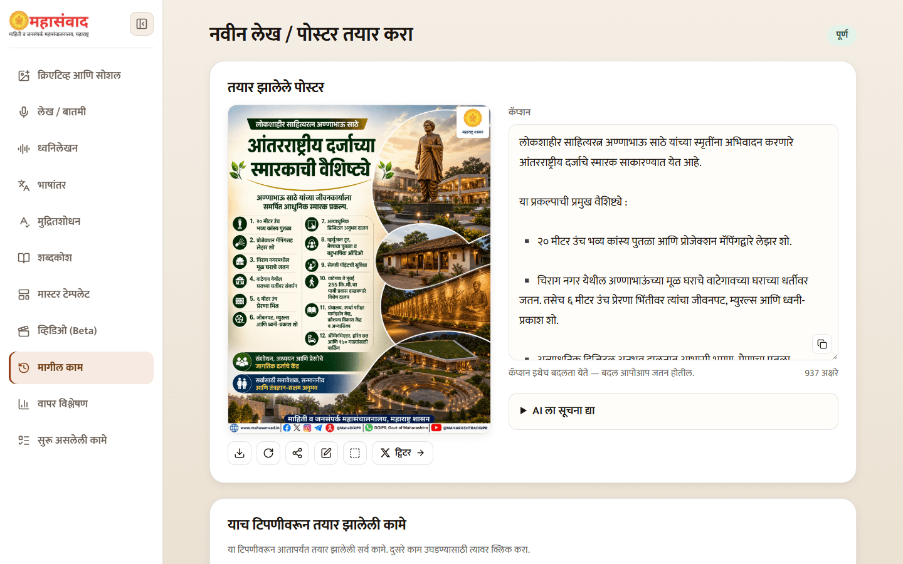

# Captions and Social Publishing

A social creative can include a Marathi caption. Tick **"कॅप्शनही तयार करा"** before starting, or add a caption later from the result page.

## Edit or generate the caption

The caption box is editable. Changes are saved automatically when you leave the field. Use the copy icon to copy it for another system.

If no caption was requested originally, choose **"कॅप्शन तयार करा"** or **"स्वतः कॅप्शन लिहा"**. AI caption generation uses only the source article; it must not add a fact that was absent from the article.

For an AI-assisted change, write what you want in the **"AI सोबत बदल करा"** box under the caption, in your own words — for example “कॅप्शन थोडे लहान करा”, “पोस्टरवरचा फोटो बदला”, or both in one sentence. There is nothing to select first: the assistant works out whether you mean the caption, the poster, a completely new design, or both, and starts the change. If it cannot tell, it asks one short question; answer it in the same box. The conversation is remembered on this computer, so a follow-up such as “आता आणखी थोडे लहान” builds on what you already asked. The bin icon clears it.

## Direct publication

Facebook results can show **"फेसबुकवर पोस्ट करा"**. Publication is an external, immediate action:

1. Read the final caption and inspect the poster at full size.
2. Select **"फेसबुकवर पोस्ट करा"**.
3. Read the warning, then select **"होय, प्रकाशित करा"** only with publication authority.
4. After success, use **"प्रकाशित पोस्ट पाहा"** to open the live post.

The platform cannot withdraw the post from this screen. Remove or correct it through the official social account if necessary.


Direct X publishing is currently unavailable. The disabled X action displays **"सध्या X वर पोस्ट करता येणार नाही"**. Download the poster and copy the caption for an authorised manual X workflow.


## Reuse another result for social

Article and poster result pages may offer **"याच मजकुरावरून ट्विटर पोस्ट तयार करा"** or **"याच मजकुरावरून फेसबुक पोस्ट तयार करा"**. This creates a linked follow-up using the same approved source, visible in the work thread.
