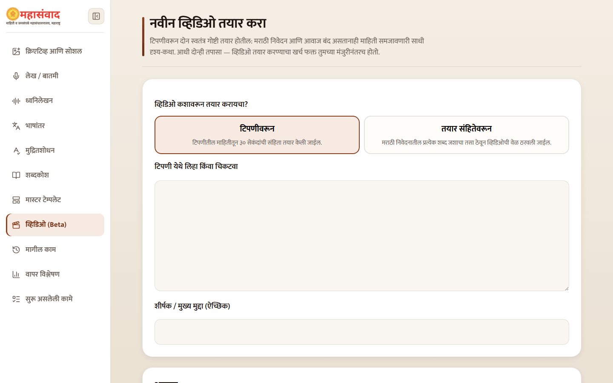
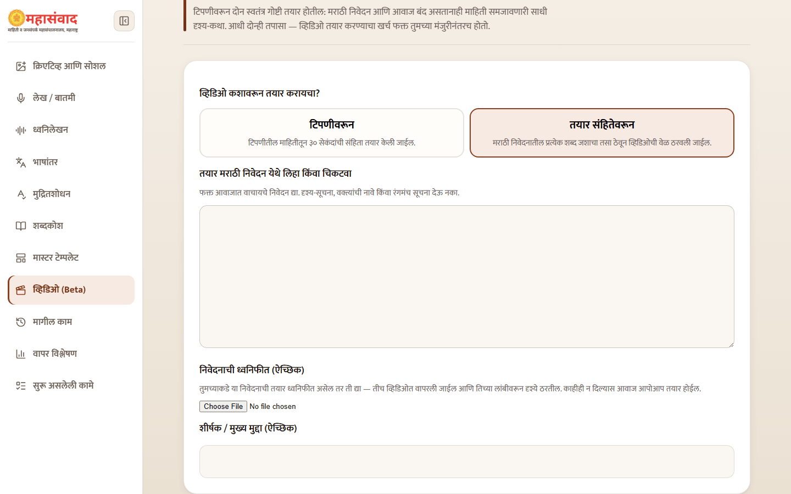
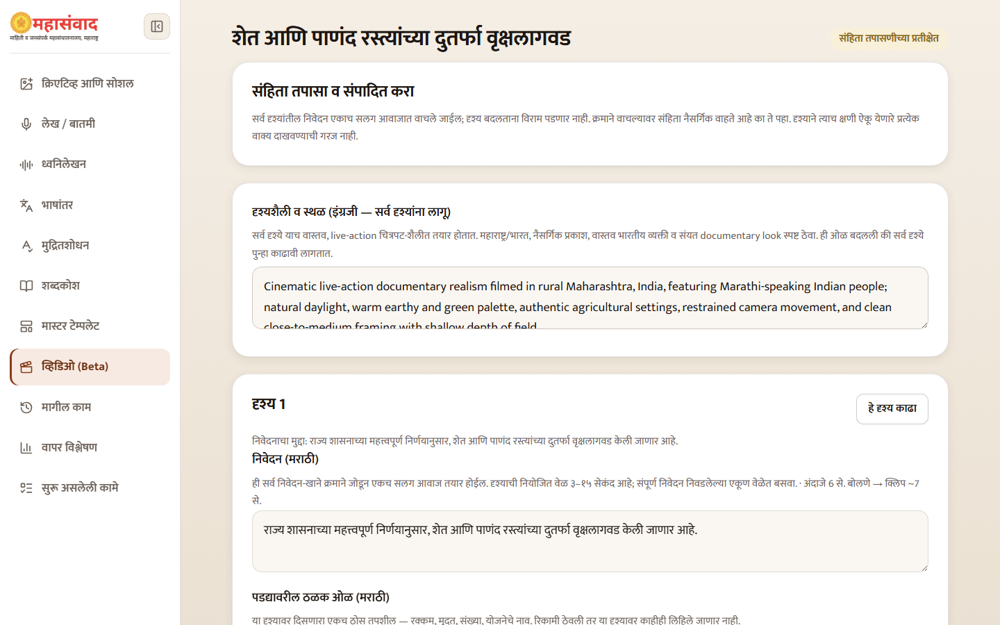
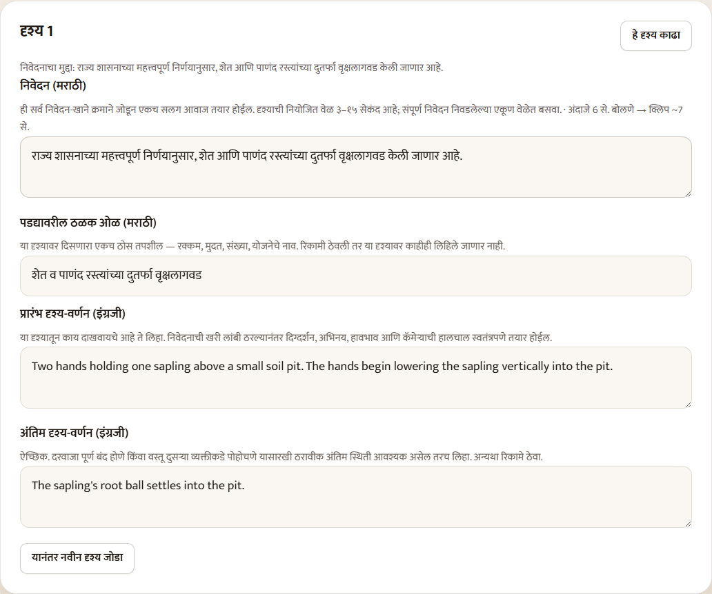
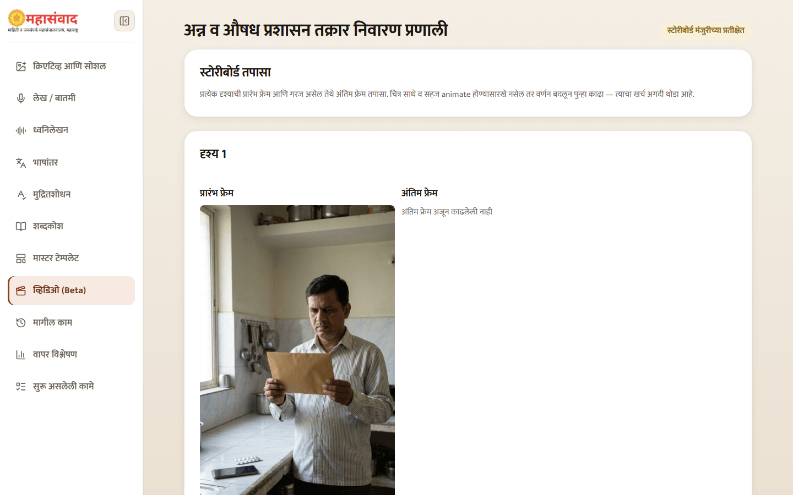
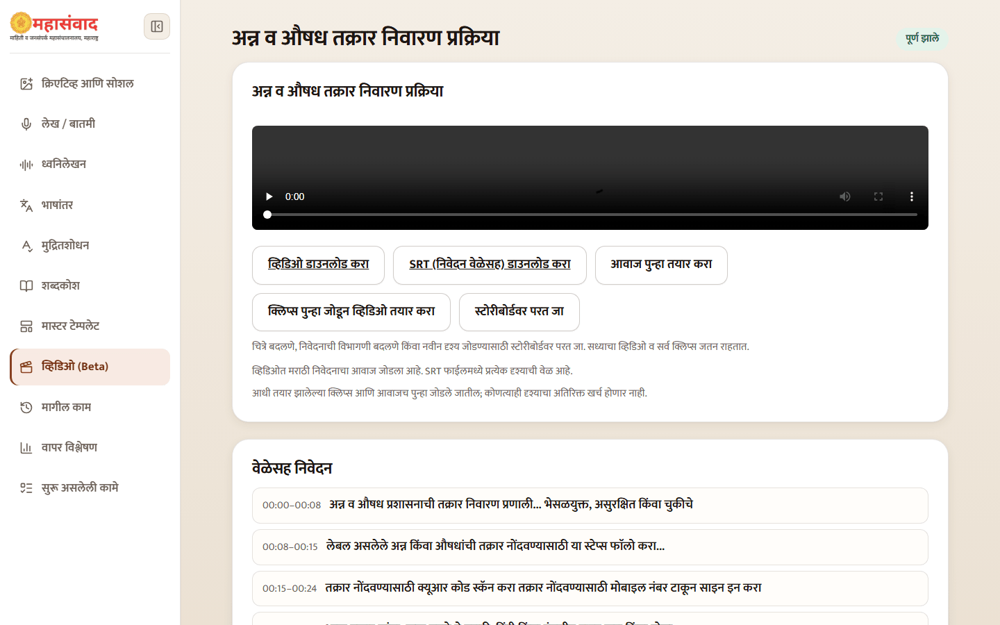
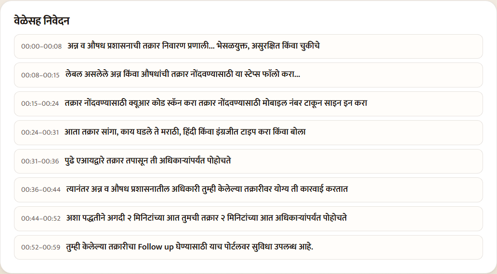

# Create a Branded Video

Use **"व्हिडिओ (Beta)"** for a short Marathi explainer in landscape or vertical format. A project moves through two approval gates before the expensive animation step.

## 1. Choose the source mode

- **"टिपणीवरून"** — the platform writes a short Marathi script from your factual note.
- **"तयार संहितेवरून"** — every word of your approved Marathi narration is kept unchanged while the platform divides it into scenes. You may also supply narration audio for this mode.

Add an optional **"शीर्षक / मुख्य मुद्दा (ऐच्छिक)"**. Choose **"आडवा (16:9)"** for YouTube/web or **"उभा (9:16)"** for reels, status, and shorts. Note mode offers **"३० सेकंद"** or **"१ मिनिट"** targets. A ready script or supplied voice track can be up to two minutes, and a project can contain no more than eight scenes.

Under **"दर्जा"**, **"संतुलित"** is the recommended choice and **"सर्वोत्तम"** requests the higher-quality server setting. Read the displayed estimate; the actual tier cost follows the current server configuration.

In note mode select **"संहिता तयार करा"**; in ready-script mode select **"दृश्य आराखडा तयार करा"**. Only one video project can be actively working at a time; if another project is active, open or finish it before starting a new one.

## 2. Approval gate: script

At **"संहिता तपासा व संपादित करा"**, review the overall English visual style and every scene's Marathi narration, visual description, key point, and end-frame brief.

Read all narration boxes in order. They become one continuous voice track, so scene boundaries should not create awkward repetition or missing context. In ready-script mode, do not add new words; redistribute the approved words between scenes instead.

You can insert or remove scenes within the limits. Select **"स्टोरीबोर्ड तयार करा"** only after the script is approved. This creates low-cost still frames, not the finished video.

## 3. Approval gate: storyboard

Review the start frame and, when present, the end frame for each scene. Confirm that the setting is appropriate for Maharashtra/India, people and objects are plausible, official facts are not invented visually, and the frame can be animated cleanly.

You may:

- change a frame description and redraw only that frame;
- edit and save the motion brief;
- move approved narration words between scenes;
- insert a scene and create only its missing frames;
- use **"बदल जतन करा"** before animation.

Select **"व्हिडिओ तयार करा"**, then accept the cost confirmation. This is the main paid step because every missing scene clip is animated.

## 4. Completed video

The final card provides:

- **"व्हिडिओ डाउनलोड करा"** for MP4;
- **"SRT (निवेदन वेळेसह) डाउनलोड करा"**;
- **"आवाज पुन्हा तयार करा"** to add or replace narration;
- **"क्लिप्स पुन्हा जोडून व्हिडिओ तयार करा"** to restitch stored clips and audio without generating scenes again;
- **"स्टोरीबोर्डवर परत जा"** for frame, scene, or narration-division changes.

The **"वेळेसह निवेदन"** card shows which narration plays during each time range.

Every generated scene and final video carries the DGIPR lockup. The finished video ends with the DGIPR contact slate. Landscape output fits the complete vertical slate on white so contact details are not cropped.

## Improve one scene

The completed page lets you change a single scene's description, redraw its frames, and choose **"फक्त हे दृश्य पुन्हा तयार करा"**. Only that scene incurs new animation cost; the previous complete video remains available while replacement work runs.


Watch the complete MP4 with sound before publication. Check every spoken word, frame, subtitle timing, logo, outro, aspect ratio, and transition—not only the first frame of each scene.

